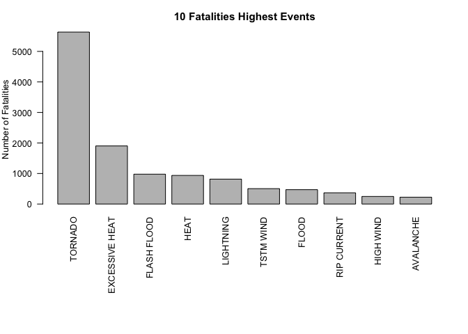
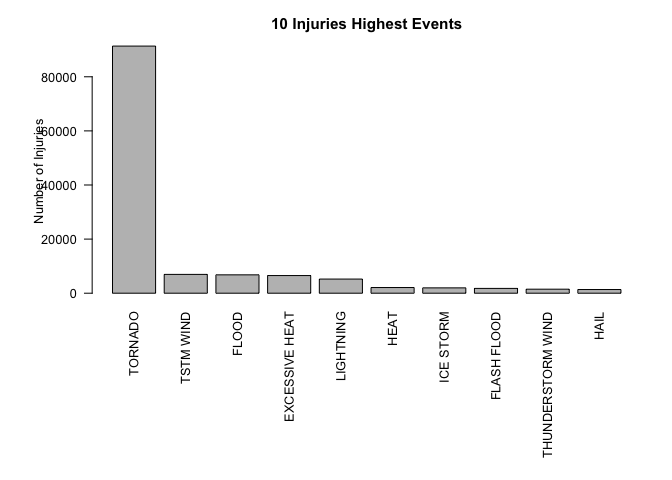
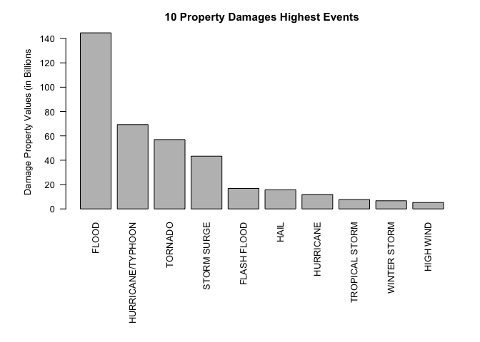

# Reproducible Research: Peer Assessment 2
Jose Antonio R Neto (joseantonio@me.com)  
# 1: TITLE: 
## ANALYSIS FROM NOAA DATASET TO IDENTIFY HEALTH AND ECONOMIC POPULATION CONSEQUENCES IN THE UNITED STATES CAUSED BY STORMS AND WEATHER EVENTS


## INTRODUCTION
Storms and other severe weather events can cause both public health and economic problems for communities and municipalities. Many severe events can result in fatalities, injuries, and property damage, and preventing such outcomes to the extent possible is a key concern.

This project involves exploring the U.S. National Oceanic and Atmospheric Administration's (NOAA) storm database. This database tracks characteristics of major storms and weather events in the United States, including when and where they occur, as well as estimates of any fatalities, injuries, and property damage.


# 2: SYNOPSIS: QUESTIONS TO BE ANSWERED
This report address the following questions:

1 - Across the United States, which types of events are most harmful with respect to population health?

2 - Across the United States, which types of events have the greatest economic consequences?


# 3: LOADING AND PRE-PROCESSING THE DATA

* Defining libraries


```r
getwd()
```

```
## [1] "/Volumes/Dados/GITHUB/RepData_PeerAssessment3"
```

```r
library(knitr)
library(markdown)
library(rmarkdown)
library(plyr)
library(dplyr)
```

```
## 
## Attaching package: 'dplyr'
```

```
## The following objects are masked from 'package:plyr':
## 
##     arrange, count, desc, failwith, id, mutate, rename, summarise,
##     summarize
```

```
## The following objects are masked from 'package:stats':
## 
##     filter, lag
```

```
## The following objects are masked from 'package:base':
## 
##     intersect, setdiff, setequal, union
```

```r
library(Hmisc)
```

```
## Loading required package: lattice
```

```
## Loading required package: survival
```

```
## Loading required package: Formula
```

```
## Loading required package: ggplot2
```

```
## 
## Attaching package: 'Hmisc'
```

```
## The following objects are masked from 'package:dplyr':
## 
##     combine, src, summarize
```

```
## The following objects are masked from 'package:plyr':
## 
##     is.discrete, summarize
```

```
## The following objects are masked from 'package:base':
## 
##     format.pval, round.POSIXt, trunc.POSIXt, units
```

* Loading the data NOAA storm data into R


```r
if (!file.exists("repdata-data-StormData.csv")) {
        download.file("https://d396qusza40orc.cloudfront.net/repdata%2Fdata%2FStormData.csv.bz2", "repdata_data_StormData.csv.bz2")
}
storm <- read.csv(file = "repdata-data-StormData.csv", header = TRUE, sep = ",")
```

* Rows and Columns of Data

```r
dim(storm)
```

```
## [1] 902297     37
```
* The Dataset has 902297 rows (observations) and 37 columns (variables). 
* The variables are:

```r
names(storm)
```

```
##  [1] "STATE__"    "BGN_DATE"   "BGN_TIME"   "TIME_ZONE"  "COUNTY"    
##  [6] "COUNTYNAME" "STATE"      "EVTYPE"     "BGN_RANGE"  "BGN_AZI"   
## [11] "BGN_LOCATI" "END_DATE"   "END_TIME"   "COUNTY_END" "COUNTYENDN"
## [16] "END_RANGE"  "END_AZI"    "END_LOCATI" "LENGTH"     "WIDTH"     
## [21] "F"          "MAG"        "FATALITIES" "INJURIES"   "PROPDMG"   
## [26] "PROPDMGEXP" "CROPDMG"    "CROPDMGEXP" "WFO"        "STATEOFFIC"
## [31] "ZONENAMES"  "LATITUDE"   "LONGITUDE"  "LATITUDE_E" "LONGITUDE_"
## [36] "REMARKS"    "REFNUM"
```

```r
str(storm)
```

```
## 'data.frame':	902297 obs. of  37 variables:
##  $ STATE__   : num  1 1 1 1 1 1 1 1 1 1 ...
##  $ BGN_DATE  : Factor w/ 16335 levels "1/1/1966 0:00:00",..: 6523 6523 4242 11116 2224 2224 2260 383 3980 3980 ...
##  $ BGN_TIME  : Factor w/ 3608 levels "000","0000","0001",..: 152 167 2645 1563 2524 3126 122 1563 3126 3126 ...
##  $ TIME_ZONE : Factor w/ 22 levels "ADT","AKS","AST",..: 6 6 6 6 6 6 6 6 6 6 ...
##  $ COUNTY    : num  97 3 57 89 43 77 9 123 125 57 ...
##  $ COUNTYNAME: Factor w/ 29601 levels "","5NM E OF MACKINAC BRIDGE TO PRESQUE ISLE LT MI",..: 13513 1873 4598 10592 4372 10094 1973 23873 24418 4598 ...
##  $ STATE     : Factor w/ 72 levels "AK","AL","AM",..: 2 2 2 2 2 2 2 2 2 2 ...
##  $ EVTYPE    : Factor w/ 985 levels "   HIGH SURF ADVISORY",..: 826 826 826 826 826 826 826 826 826 826 ...
##  $ BGN_RANGE : num  0 0 0 0 0 0 0 0 0 0 ...
##  $ BGN_AZI   : Factor w/ 35 levels "","  N"," NW",..: 1 1 1 1 1 1 1 1 1 1 ...
##  $ BGN_LOCATI: Factor w/ 54429 levels ""," Christiansburg",..: 1 1 1 1 1 1 1 1 1 1 ...
##  $ END_DATE  : Factor w/ 6663 levels "","1/1/1993 0:00:00",..: 1 1 1 1 1 1 1 1 1 1 ...
##  $ END_TIME  : Factor w/ 3647 levels ""," 0900CST",..: 1 1 1 1 1 1 1 1 1 1 ...
##  $ COUNTY_END: num  0 0 0 0 0 0 0 0 0 0 ...
##  $ COUNTYENDN: logi  NA NA NA NA NA NA ...
##  $ END_RANGE : num  0 0 0 0 0 0 0 0 0 0 ...
##  $ END_AZI   : Factor w/ 24 levels "","E","ENE","ESE",..: 1 1 1 1 1 1 1 1 1 1 ...
##  $ END_LOCATI: Factor w/ 34506 levels ""," CANTON"," TULIA",..: 1 1 1 1 1 1 1 1 1 1 ...
##  $ LENGTH    : num  14 2 0.1 0 0 1.5 1.5 0 3.3 2.3 ...
##  $ WIDTH     : num  100 150 123 100 150 177 33 33 100 100 ...
##  $ F         : int  3 2 2 2 2 2 2 1 3 3 ...
##  $ MAG       : num  0 0 0 0 0 0 0 0 0 0 ...
##  $ FATALITIES: num  0 0 0 0 0 0 0 0 1 0 ...
##  $ INJURIES  : num  15 0 2 2 2 6 1 0 14 0 ...
##  $ PROPDMG   : num  25 2.5 25 2.5 2.5 2.5 2.5 2.5 25 25 ...
##  $ PROPDMGEXP: Factor w/ 19 levels "","+","-","0",..: 16 16 16 16 16 16 16 16 16 16 ...
##  $ CROPDMG   : num  0 0 0 0 0 0 0 0 0 0 ...
##  $ CROPDMGEXP: Factor w/ 9 levels "","0","2","?",..: 1 1 1 1 1 1 1 1 1 1 ...
##  $ WFO       : Factor w/ 542 levels ""," CI","$AC",..: 1 1 1 1 1 1 1 1 1 1 ...
##  $ STATEOFFIC: Factor w/ 250 levels "","ALABAMA, Central",..: 1 1 1 1 1 1 1 1 1 1 ...
##  $ ZONENAMES : Factor w/ 25112 levels "","                                                                                                                               "| __truncated__,..: 1 1 1 1 1 1 1 1 1 1 ...
##  $ LATITUDE  : num  3040 3042 3340 3458 3412 ...
##  $ LONGITUDE : num  8812 8755 8742 8626 8642 ...
##  $ LATITUDE_E: num  3051 0 0 0 0 ...
##  $ LONGITUDE_: num  8806 0 0 0 0 ...
##  $ REMARKS   : Factor w/ 436781 levels "","\t","\t\t",..: 1 1 1 1 1 1 1 1 1 1 ...
##  $ REFNUM    : num  1 2 3 4 5 6 7 8 9 10 ...
```

* See two Observations of STORM Dataset


```r
head(storm, n=2)
```

```
##   STATE__          BGN_DATE BGN_TIME TIME_ZONE COUNTY COUNTYNAME STATE
## 1       1 4/18/1950 0:00:00     0130       CST     97     MOBILE    AL
## 2       1 4/18/1950 0:00:00     0145       CST      3    BALDWIN    AL
##    EVTYPE BGN_RANGE BGN_AZI BGN_LOCATI END_DATE END_TIME COUNTY_END
## 1 TORNADO         0                                               0
## 2 TORNADO         0                                               0
##   COUNTYENDN END_RANGE END_AZI END_LOCATI LENGTH WIDTH F MAG FATALITIES
## 1         NA         0                        14   100 3   0          0
## 2         NA         0                         2   150 2   0          0
##   INJURIES PROPDMG PROPDMGEXP CROPDMG CROPDMGEXP WFO STATEOFFIC ZONENAMES
## 1       15    25.0          K       0                                    
## 2        0     2.5          K       0                                    
##   LATITUDE LONGITUDE LATITUDE_E LONGITUDE_ REMARKS REFNUM
## 1     3040      8812       3051       8806              1
## 2     3042      8755          0          0              2
```


# 4: PROCESSING THE DATA

Lets answer the question about Which Types of Events are most Harmful for population HEALTH?


## 4.1 - WHICH TYPES OF EVENTS THAT ARE MOST HARMFUL TO POPULATION HEALTH?

The item 2.6 (page 9) of National Weather Service Storm Data documentation describes about Fatalities and Injuries. So, it is necessary to assess theses Variables to define which of EVENTS (EVTYPE) are most harmful. If you want, connect with National Weather Service using the link [Storm Data Documentation](https://d396qusza40orc.cloudfront.net/repdata%2Fpeer2_doc%2Fpd01016005curr.pdf)

* Lets evaluate the number of FATALITIES and INJURIES per Type of Event (EVTYPE)

* NUMBER of FATALITIES per EVENT:


```r
sumFatalities <- aggregate(FATALITIES ~ EVTYPE, data = storm,  FUN="sum")
sumFatalities  ## 985 observations
```

```
##                             EVTYPE FATALITIES
## 1               HIGH SURF ADVISORY          0
## 2                    COASTAL FLOOD          0
## 3                      FLASH FLOOD          0
## 4                        LIGHTNING          0
## 5                        TSTM WIND          0
## 6                  TSTM WIND (G45)          0
## 7                       WATERSPOUT          0
## 8                             WIND          0
## 9                                ?          0
## 10                 ABNORMAL WARMTH          0
## 11                  ABNORMALLY DRY          0
## 12                  ABNORMALLY WET          0
## 13            ACCUMULATED SNOWFALL          0
## 14             AGRICULTURAL FREEZE          0
## 15                   APACHE COUNTY          0
## 16          ASTRONOMICAL HIGH TIDE          0
## 17           ASTRONOMICAL LOW TIDE          0
## 18                        AVALANCE          1
## 19                       AVALANCHE        224
## 20                    BEACH EROSIN          0
## 21                   BEACH EROSION          0
## 22     BEACH EROSION/COASTAL FLOOD          0
## 23                     BEACH FLOOD          0
## 24      BELOW NORMAL PRECIPITATION          0
## 25               BITTER WIND CHILL          0
## 26  BITTER WIND CHILL TEMPERATURES          0
## 27                       BLACK ICE          1
## 28                        BLIZZARD        101
## 29  BLIZZARD AND EXTREME WIND CHIL          0
## 30         BLIZZARD AND HEAVY SNOW          0
## 31                BLIZZARD WEATHER          0
## 32          BLIZZARD/FREEZING RAIN          0
## 33             BLIZZARD/HEAVY SNOW          0
## 34              BLIZZARD/HIGH WIND          0
## 35           BLIZZARD/WINTER STORM          0
## 36                   BLOW-OUT TIDE          0
## 37                  BLOW-OUT TIDES          0
## 38                    BLOWING DUST          0
## 39                    BLOWING SNOW          1
## 40  BLOWING SNOW & EXTREME WIND CH          0
## 41  BLOWING SNOW- EXTREME WIND CHI          0
## 42  BLOWING SNOW/EXTREME WIND CHIL          0
## 43                BREAKUP FLOODING          0
## 44                      BRUSH FIRE          0
## 45                     BRUSH FIRES          0
## 46                   Beach Erosion          0
## 47                       Black Ice          0
## 48                Blizzard Summary          0
## 49                    Blowing Snow          0
## 50       COASTAL  FLOODING/EROSION          0
## 51                 COASTAL EROSION          0
## 52                   COASTAL FLOOD          3
## 53                COASTAL FLOODING          1
## 54        COASTAL FLOODING/EROSION          0
## 55                   COASTAL STORM          3
## 56                   COASTAL SURGE          0
## 57             COASTAL/TIDAL FLOOD          0
## 58                    COASTALFLOOD          0
## 59                    COASTALSTORM          1
## 60                            COLD         35
## 61                 COLD AIR FUNNEL          0
## 62                COLD AIR FUNNELS          0
## 63                COLD AIR TORNADO          0
## 64                  COLD AND FROST          0
## 65                   COLD AND SNOW         14
## 66         COLD AND WET CONDITIONS          0
## 67               COLD TEMPERATURES          0
## 68                       COLD WAVE          3
## 69                    COLD WEATHER          5
## 70    COLD WIND CHILL TEMPERATURES          0
## 71                 COLD/WIND CHILL         95
## 72                      COLD/WINDS          1
## 73                    COOL AND WET          0
## 74                      COOL SPELL          0
## 75           CSTL FLOODING/EROSION          0
## 76                   Coastal Flood          0
## 77                Coastal Flooding          2
## 78                   Coastal Storm          0
## 79                            Cold          3
## 80                Cold Temperature          2
## 81                  Cold and Frost          0
## 82                       DAM BREAK          0
## 83                     DAM FAILURE          0
## 84                 DAMAGING FREEZE          0
## 85                       DEEP HAIL          0
## 86                       DENSE FOG         18
## 87                     DENSE SMOKE          0
## 88                       DOWNBURST          0
## 89                 DOWNBURST WINDS          0
## 90                    DRIEST MONTH          0
## 91                         DROUGHT          0
## 92          DROUGHT/EXCESSIVE HEAT          2
## 93                        DROWNING          1
## 94                             DRY          0
## 95                  DRY CONDITIONS          0
## 96                 DRY HOT WEATHER          0
## 97                  DRY MICROBURST          3
## 98               DRY MICROBURST 50          0
## 99               DRY MICROBURST 53          0
## 100              DRY MICROBURST 58          0
## 101              DRY MICROBURST 61          0
## 102              DRY MICROBURST 84          0
## 103           DRY MICROBURST WINDS          0
## 104           DRY MIRCOBURST WINDS          0
## 105                    DRY PATTERN          0
## 106                      DRY SPELL          0
## 107                    DRY WEATHER          0
## 108                        DRYNESS          0
## 109                     DUST DEVEL          0
## 110                     DUST DEVIL          2
## 111          DUST DEVIL WATERSPOUT          0
## 112                     DUST STORM         22
## 113          DUST STORM/HIGH WINDS          0
## 114                      DUSTSTORM          0
## 115                Damaging Freeze          0
## 116                  Drifting Snow          0
## 117                     Dust Devil          0
## 118                   EARLY FREEZE          0
## 119                    EARLY FROST          0
## 120                     EARLY RAIN          0
## 121                     EARLY SNOW          0
## 122                 EARLY SNOWFALL          0
## 123                      EXCESSIVE          0
## 124                 EXCESSIVE HEAT       1903
## 125         EXCESSIVE HEAT/DROUGHT          0
## 126        EXCESSIVE PRECIPITATION          0
## 127                 EXCESSIVE RAIN          0
## 128             EXCESSIVE RAINFALL          2
## 129                 EXCESSIVE SNOW          0
## 130              EXCESSIVE WETNESS          0
## 131                EXCESSIVELY DRY          0
## 132                   EXTREME COLD        160
## 133        EXTREME COLD/WIND CHILL        125
## 134                   EXTREME HEAT         96
## 135             EXTREME WIND CHILL          0
## 136 EXTREME WIND CHILL/BLOWING SNO          0
## 137            EXTREME WIND CHILLS          0
## 138              EXTREME WINDCHILL         17
## 139 EXTREME WINDCHILL TEMPERATURES          0
## 140            EXTREME/RECORD COLD          0
## 141                  EXTREMELY WET          0
## 142                    Early Frost          0
## 143                 Early snowfall          0
## 144             Erosion/Cstl Flood          0
## 145                 Excessive Cold          0
## 146                  Extended Cold          1
## 147                   Extreme Cold          2
## 148               FALLING SNOW/ICE          1
## 149                    FIRST FROST          0
## 150                     FIRST SNOW          0
## 151                    FLASH FLOOD        978
## 152       FLASH FLOOD - HEAVY RAIN          0
## 153      FLASH FLOOD FROM ICE JAMS          0
## 154         FLASH FLOOD LANDSLIDES          0
## 155              FLASH FLOOD WINDS          0
## 156                   FLASH FLOOD/          0
## 157             FLASH FLOOD/ FLOOD          0
## 158            FLASH FLOOD/ STREET          0
## 159              FLASH FLOOD/FLOOD         14
## 160         FLASH FLOOD/HEAVY RAIN          0
## 161          FLASH FLOOD/LANDSLIDE          0
## 162                 FLASH FLOODING         19
## 163           FLASH FLOODING/FLOOD          5
## 164 FLASH FLOODING/THUNDERSTORM WI          0
## 165                   FLASH FLOODS          2
## 166                FLASH FLOOODING          0
## 167                          FLOOD        470
## 168             FLOOD & HEAVY RAIN          1
## 169                    FLOOD FLASH          0
## 170              FLOOD FLOOD/FLASH          0
## 171                   FLOOD WATCH/          0
## 172                    FLOOD/FLASH          0
## 173              FLOOD/FLASH FLOOD         17
## 174           FLOOD/FLASH FLOODING          0
## 175              FLOOD/FLASH/FLOOD          0
## 176               FLOOD/FLASHFLOOD          0
## 177                FLOOD/RAIN/WIND          0
## 178               FLOOD/RAIN/WINDS          0
## 179              FLOOD/RIVER FLOOD          1
## 180                       FLOODING          6
## 181            FLOODING/HEAVY RAIN          0
## 182                         FLOODS          0
## 183                            FOG         62
## 184      FOG AND COLD TEMPERATURES          1
## 185                   FOREST FIRES          0
## 186                         FREEZE          1
## 187               FREEZING DRIZZLE          2
## 188  FREEZING DRIZZLE AND FREEZING          0
## 189                   FREEZING FOG          0
## 190                  FREEZING RAIN          7
## 191        FREEZING RAIN AND SLEET          0
## 192         FREEZING RAIN AND SNOW          0
## 193        FREEZING RAIN SLEET AND          0
## 194  FREEZING RAIN SLEET AND LIGHT          0
## 195            FREEZING RAIN/SLEET          0
## 196             FREEZING RAIN/SNOW          1
## 197                          FROST          1
## 198                   FROST/FREEZE          0
## 199                  FROST\\FREEZE          0
## 200                         FUNNEL          0
## 201                   FUNNEL CLOUD          0
## 202                  FUNNEL CLOUD.          0
## 203              FUNNEL CLOUD/HAIL          0
## 204                  FUNNEL CLOUDS          0
## 205                        FUNNELS          0
## 206                          Flood          0
## 207              Flood/Flash Flood          0
## 208              Flood/Strong Wind          0
## 209                         Freeze          0
## 210               Freezing Drizzle          0
## 211                   Freezing Fog          0
## 212                  Freezing Rain          0
## 213                 Freezing Spray          1
## 214               Freezing drizzle          0
## 215                  Freezing rain          0
## 216                          Frost          0
## 217                   Frost/Freeze          0
## 218                   Funnel Cloud          0
## 219                          GLAZE          7
## 220                      GLAZE ICE          0
## 221                GLAZE/ICE STORM          0
## 222                  GRADIENT WIND          0
## 223                 GRADIENT WINDS          0
## 224                    GRASS FIRES          0
## 225                GROUND BLIZZARD          0
## 226                       GUSTNADO          0
## 227                   GUSTNADO AND          0
## 228                GUSTY LAKE WIND          0
## 229        GUSTY THUNDERSTORM WIND          0
## 230       GUSTY THUNDERSTORM WINDS          0
## 231                     GUSTY WIND          1
## 232                GUSTY WIND/HAIL          0
## 233            GUSTY WIND/HVY RAIN          0
## 234                    GUSTY WINDS          4
## 235                          Glaze          0
## 236                  Gradient wind          0
## 237                     Gusty Wind          0
## 238                    Gusty Winds          0
## 239                Gusty wind/rain          0
## 240                    Gusty winds          0
## 241                           HAIL         15
## 242                      HAIL 0.75          0
## 243                      HAIL 0.88          0
## 244                       HAIL 075          0
## 245                       HAIL 088          0
## 246                      HAIL 1.00          0
## 247                      HAIL 1.75          0
## 248                     HAIL 1.75)          0
## 249                       HAIL 100          0
## 250                       HAIL 125          0
## 251                       HAIL 150          0
## 252                       HAIL 175          0
## 253                       HAIL 200          0
## 254                       HAIL 225          0
## 255                       HAIL 275          0
## 256                       HAIL 450          0
## 257                        HAIL 75          0
## 258                        HAIL 80          0
## 259                        HAIL 88          0
## 260                     HAIL ALOFT          0
## 261                    HAIL DAMAGE          0
## 262                  HAIL FLOODING          0
## 263                     HAIL STORM          0
## 264                 HAIL/ICY ROADS          0
## 265                      HAIL/WIND          0
## 266                     HAIL/WINDS          0
## 267                      HAILSTORM          0
## 268                     HAILSTORMS          0
## 269                    HARD FREEZE          0
## 270                 HAZARDOUS SURF          0
## 271                           HEAT        937
## 272                   HEAT DROUGHT          0
## 273                      HEAT WAVE        172
## 274              HEAT WAVE DROUGHT          4
## 275                     HEAT WAVES          5
## 276                   HEAT/DROUGHT          0
## 277                HEAVY LAKE SNOW          0
## 278                      HEAVY MIX          0
## 279            HEAVY PRECIPATATION          0
## 280            HEAVY PRECIPITATION          0
## 281                     HEAVY RAIN         98
## 282           HEAVY RAIN AND FLOOD          0
## 283             HEAVY RAIN EFFECTS          0
## 284            HEAVY RAIN/FLOODING          0
## 285           HEAVY RAIN/LIGHTNING          0
## 286     HEAVY RAIN/MUDSLIDES/FLOOD          0
## 287      HEAVY RAIN/SEVERE WEATHER          0
## 288  HEAVY RAIN/SMALL STREAM URBAN          0
## 289                HEAVY RAIN/SNOW          0
## 290         HEAVY RAIN/URBAN FLOOD          0
## 291                HEAVY RAIN/WIND          0
## 292 HEAVY RAIN; URBAN FLOOD WINDS;          0
## 293                 HEAVY RAINFALL          0
## 294                    HEAVY RAINS          0
## 295           HEAVY RAINS/FLOODING          0
## 296                     HEAVY SEAS          3
## 297                   HEAVY SHOWER          0
## 298                  HEAVY SHOWERS          0
## 299                     HEAVY SNOW        127
## 300     HEAVY SNOW   FREEZING RAIN          0
## 301               HEAVY SNOW & ICE          0
## 302                 HEAVY SNOW AND          0
## 303      HEAVY SNOW AND HIGH WINDS          2
## 304             HEAVY SNOW AND ICE          0
## 305       HEAVY SNOW AND ICE STORM          0
## 306    HEAVY SNOW AND STRONG WINDS          0
## 307     HEAVY SNOW ANDBLOWING SNOW          0
## 308             HEAVY SNOW SQUALLS          0
## 309             HEAVY SNOW-SQUALLS          0
## 310            HEAVY SNOW/BLIZZARD          0
## 311  HEAVY SNOW/BLIZZARD/AVALANCHE          0
## 312        HEAVY SNOW/BLOWING SNOW          0
## 313       HEAVY SNOW/FREEZING RAIN          0
## 314                HEAVY SNOW/HIGH          0
## 315           HEAVY SNOW/HIGH WIND          0
## 316          HEAVY SNOW/HIGH WINDS          0
## 317  HEAVY SNOW/HIGH WINDS & FLOOD          0
## 318 HEAVY SNOW/HIGH WINDS/FREEZING          0
## 319                 HEAVY SNOW/ICE          0
## 320           HEAVY SNOW/ICE STORM          0
## 321               HEAVY SNOW/SLEET          0
## 322             HEAVY SNOW/SQUALLS          0
## 323                HEAVY SNOW/WIND          0
## 324        HEAVY SNOW/WINTER STORM          0
## 325                 HEAVY SNOWPACK          0
## 326                     HEAVY SURF          7
## 327    HEAVY SURF COASTAL FLOODING          0
## 328           HEAVY SURF/HIGH SURF         42
## 329                   HEAVY SWELLS          0
## 330                 HEAVY WET SNOW          0
## 331                           HIGH          0
## 332                   HIGH  SWELLS          0
## 333                    HIGH  WINDS          0
## 334                      HIGH SEAS          5
## 335                      HIGH SURF        101
## 336           HIGH SURF ADVISORIES          0
## 337             HIGH SURF ADVISORY          0
## 338                    HIGH SWELLS          1
## 339        HIGH TEMPERATURE RECORD          0
## 340                     HIGH TIDES          0
## 341                     HIGH WATER          3
## 342                     HIGH WAVES          1
## 343                      HIGH WIND        248
## 344                HIGH WIND (G40)          0
## 345                   HIGH WIND 48          0
## 346                   HIGH WIND 63          0
## 347                   HIGH WIND 70          0
## 348       HIGH WIND AND HEAVY SNOW          0
## 349       HIGH WIND AND HIGH TIDES          0
## 350             HIGH WIND AND SEAS          3
## 351               HIGH WIND DAMAGE          0
## 352            HIGH WIND/ BLIZZARD          0
## 353             HIGH WIND/BLIZZARD          0
## 354 HIGH WIND/BLIZZARD/FREEZING RA          0
## 355           HIGH WIND/HEAVY SNOW          0
## 356       HIGH WIND/LOW WIND CHILL          0
## 357                 HIGH WIND/SEAS          4
## 358           HIGH WIND/WIND CHILL          0
## 359  HIGH WIND/WIND CHILL/BLIZZARD          0
## 360                     HIGH WINDS         35
## 361                  HIGH WINDS 55          0
## 362                  HIGH WINDS 57          0
## 363                  HIGH WINDS 58          0
## 364                  HIGH WINDS 63          0
## 365                  HIGH WINDS 66          0
## 366                  HIGH WINDS 67          0
## 367                  HIGH WINDS 73          0
## 368                  HIGH WINDS 76          0
## 369                  HIGH WINDS 80          0
## 370                  HIGH WINDS 82          0
## 371      HIGH WINDS AND WIND CHILL          0
## 372          HIGH WINDS DUST STORM          0
## 373         HIGH WINDS HEAVY RAINS          0
## 374                    HIGH WINDS/          0
## 375       HIGH WINDS/COASTAL FLOOD          0
## 376                HIGH WINDS/COLD          0
## 377            HIGH WINDS/FLOODING          0
## 378          HIGH WINDS/HEAVY RAIN          0
## 379                HIGH WINDS/SNOW          3
## 380               HIGHWAY FLOODING          0
## 381                    HOT PATTERN          0
## 382                      HOT SPELL          0
## 383                    HOT WEATHER          0
## 384                HOT/DRY PATTERN          0
## 385                      HURRICANE         61
## 386                HURRICANE EMILY          0
## 387                 HURRICANE ERIN          6
## 388                HURRICANE FELIX          1
## 389               HURRICANE GORDON          0
## 390                 HURRICANE OPAL          1
## 391      HURRICANE OPAL/HIGH WINDS          2
## 392     HURRICANE-GENERATED SWELLS          0
## 393              HURRICANE/TYPHOON         64
## 394                       HVY RAIN          0
## 395          HYPERTHERMIA/EXPOSURE          1
## 396                    HYPOTHERMIA          1
## 397           HYPOTHERMIA/EXPOSURE          3
## 398                     Hail(0.75)          0
## 399                      Heat Wave          0
## 400                      Heatburst          0
## 401            Heavy Precipitation          0
## 402                     Heavy Rain          0
## 403            Heavy Rain and Wind          0
## 404           Heavy Rain/High Surf          0
## 405                     Heavy Surf          1
## 406                     Heavy rain          0
## 407              Heavy snow shower          0
## 408            Heavy surf and wind          3
## 409                      High Surf          3
## 410                      High Wind          0
## 411                    Hot and Dry          0
## 412              Hurricane Edouard          0
## 413           Hypothermia/Exposure          4
## 414                            ICE          6
## 415                   ICE AND SNOW          0
## 416                      ICE FLOES          0
## 417                        ICE JAM          0
## 418               ICE JAM FLOODING          0
## 419                    ICE ON ROAD          1
## 420                    ICE PELLETS          0
## 421                      ICE ROADS          0
## 422                      ICE STORM         89
## 423             ICE STORM AND SNOW          0
## 424          ICE STORM/FLASH FLOOD          0
## 425                       ICE/SNOW          0
## 426               ICE/STRONG WINDS          0
## 427                      ICY ROADS          5
## 428                        Ice Fog          0
## 429           Ice jam flood (minor          0
## 430                       Ice/Snow          0
## 431              Icestorm/Blizzard          0
## 432                      Icy Roads          0
## 433                   LACK OF SNOW          0
## 434               LAKE EFFECT SNOW          0
## 435                     LAKE FLOOD          0
## 436               LAKE-EFFECT SNOW          0
## 437                LAKESHORE FLOOD          0
## 438                      LANDSLIDE         38
## 439          LANDSLIDE/URBAN FLOOD          0
## 440                     LANDSLIDES          1
## 441                      LANDSLUMP          0
## 442                      LANDSPOUT          0
## 443               LARGE WALL CLOUD          0
## 444                    LATE FREEZE          0
## 445               LATE SEASON HAIL          0
## 446               LATE SEASON SNOW          0
## 447                      LATE SNOW          0
## 448            LIGHT FREEZING RAIN          0
## 449                     LIGHT SNOW          1
## 450           LIGHT SNOW AND SLEET          0
## 451     LIGHT SNOW/FREEZING PRECIP          0
## 452                       LIGHTING          0
## 453                      LIGHTNING        816
## 454             LIGHTNING  WAUSEON          0
## 455       LIGHTNING AND HEAVY RAIN          0
## 456 LIGHTNING AND THUNDERSTORM WIN          0
## 457            LIGHTNING AND WINDS          0
## 458               LIGHTNING DAMAGE          0
## 459                 LIGHTNING FIRE          0
## 460               LIGHTNING INJURY          0
## 461   LIGHTNING THUNDERSTORM WINDS          0
## 462  LIGHTNING THUNDERSTORM WINDSS          0
## 463                     LIGHTNING.          1
## 464           LIGHTNING/HEAVY RAIN          0
## 465                      LIGNTNING          0
## 466              LOCAL FLASH FLOOD          0
## 467                    LOCAL FLOOD          0
## 468             LOCALLY HEAVY RAIN          0
## 469                LOW TEMPERATURE          7
## 470         LOW TEMPERATURE RECORD          0
## 471                 LOW WIND CHILL          0
## 472               Lake Effect Snow          0
## 473                      Landslump          0
## 474           Late Season Snowfall          0
## 475           Late-season Snowfall          0
## 476                     Light Snow          0
## 477            Light Snow/Flurries          0
## 478                 Light Snowfall          0
## 479                     Light snow          0
## 480                    MAJOR FLOOD          0
## 481                    MARINE HAIL          0
## 482               MARINE HIGH WIND          1
## 483                  MARINE MISHAP          7
## 484             MARINE STRONG WIND         14
## 485       MARINE THUNDERSTORM WIND         10
## 486               MARINE TSTM WIND          9
## 487                     MICROBURST          0
## 488               MICROBURST WINDS          0
## 489                   MILD PATTERN          0
## 490               MILD/DRY PATTERN          0
## 491                    MINOR FLOOD          0
## 492                 MINOR FLOODING          1
## 493                   MIXED PRECIP          2
## 494            MIXED PRECIPITATION          0
## 495                  MODERATE SNOW          0
## 496              MODERATE SNOWFALL          0
## 497          MONTHLY PRECIPITATION          0
## 498               MONTHLY RAINFALL          0
## 499               MONTHLY SNOWFALL          0
## 500            MONTHLY TEMPERATURE          0
## 501                      MUD SLIDE          0
## 502                     MUD SLIDES          0
## 503      MUD SLIDES URBAN FLOODING          0
## 504                 MUD/ROCK SLIDE          0
## 505                       MUDSLIDE          0
## 506             MUDSLIDE/LANDSLIDE          0
## 507                      MUDSLIDES          0
## 508                Marine Accident          1
## 509            Metro Storm, May 26          0
## 510                     Microburst          0
## 511           Mild and Dry Pattern          0
## 512                 Minor Flooding          0
## 513            Mixed Precipitation          0
## 514               Monthly Rainfall          0
## 515               Monthly Snowfall          0
## 516                 Mountain Snows          0
## 517                       Mudslide          4
## 518                      Mudslides          1
## 519               NEAR RECORD SNOW          0
## 520                NON SEVERE HAIL          0
## 521                  NON TSTM WIND          0
## 522         NON-SEVERE WIND DAMAGE          0
## 523                  NON-TSTM WIND          0
## 524                           NONE          0
## 525           NORMAL PRECIPITATION          0
## 526                NORTHERN LIGHTS          0
## 527              No Severe Weather          0
## 528                          OTHER          0
## 529                          Other          0
## 530               PATCHY DENSE FOG          0
## 531                     PATCHY ICE          0
## 532                   PROLONG COLD          0
## 533              PROLONG COLD/SNOW          0
## 534                 PROLONG WARMTH          0
## 535                 PROLONGED RAIN          0
## 536                   Prolong Cold          0
## 537                           RAIN          0
## 538                   RAIN (HEAVY)          0
## 539                  RAIN AND WIND          0
## 540                      RAIN/SNOW          4
## 541                      RAIN/WIND          1
## 542                      RAINSTORM          0
## 543           RAPIDLY RISING WATER          1
## 544                   RECORD  COLD          0
## 545                    RECORD COLD          1
## 546      RECORD COLD AND HIGH WIND          0
## 547              RECORD COLD/FROST          0
## 548                    RECORD COOL          0
## 549                 RECORD DRYNESS          0
## 550                    RECORD HEAT          2
## 551               RECORD HEAT WAVE          0
## 552                    RECORD HIGH          0
## 553        RECORD HIGH TEMPERATURE          0
## 554       RECORD HIGH TEMPERATURES          0
## 555                     RECORD LOW          0
## 556            RECORD LOW RAINFALL          0
## 557           RECORD PRECIPITATION          0
## 558                RECORD RAINFALL          0
## 559                    RECORD SNOW          0
## 560               RECORD SNOW/COLD          0
## 561                RECORD SNOWFALL          0
## 562             RECORD TEMPERATURE          0
## 563            RECORD TEMPERATURES          0
## 564                    RECORD WARM          0
## 565             RECORD WARM TEMPS.          0
## 566                  RECORD WARMTH          0
## 567          RECORD/EXCESSIVE HEAT         17
## 568      RECORD/EXCESSIVE RAINFALL          0
## 569              RED FLAG CRITERIA          0
## 570               RED FLAG FIRE WX          0
## 571              REMNANTS OF FLOYD          0
## 572                    RIP CURRENT        368
## 573                   RIP CURRENTS        204
## 574        RIP CURRENTS HEAVY SURF          0
## 575        RIP CURRENTS/HEAVY SURF          5
## 576         RIVER AND STREAM FLOOD          0
## 577                    RIVER FLOOD          2
## 578                 RIVER FLOODING          2
## 579                     ROCK SLIDE          0
## 580                     ROGUE WAVE          0
## 581            ROTATING WALL CLOUD          0
## 582                     ROUGH SEAS          8
## 583                     ROUGH SURF          4
## 584                    RURAL FLOOD          0
## 585                    Rain Damage          0
## 586                    Record Cold          0
## 587                    Record Heat          0
## 588                    Record High          0
## 589                Record May Snow          0
## 590            Record Temperatures          0
## 591                  Record Warmth          0
## 592             Record Winter Snow          0
## 593               Record dry month          0
## 594             Record temperature          0
## 595                 River Flooding          0
## 596                   SAHARAN DUST          0
## 597                         SEICHE          0
## 598                    SEVERE COLD          0
## 599            SEVERE THUNDERSTORM          0
## 600      SEVERE THUNDERSTORM WINDS          0
## 601           SEVERE THUNDERSTORMS          0
## 602              SEVERE TURBULENCE          0
## 603                          SLEET          2
## 604          SLEET & FREEZING RAIN          0
## 605                    SLEET STORM          0
## 606            SLEET/FREEZING RAIN          0
## 607                SLEET/ICE STORM          0
## 608                SLEET/RAIN/SNOW          0
## 609                     SLEET/SNOW          0
## 610                     SMALL HAIL          0
## 611                   SMALL STREAM          0
## 612               SMALL STREAM AND          0
## 613   SMALL STREAM AND URBAN FLOOD          0
## 614 SMALL STREAM AND URBAN FLOODIN          0
## 615             SMALL STREAM FLOOD          0
## 616          SMALL STREAM FLOODING          0
## 617       SMALL STREAM URBAN FLOOD          0
## 618       SMALL STREAM/URBAN FLOOD          0
## 619                          SMOKE          0
## 620                           SNOW          5
## 621              SNOW ACCUMULATION          0
## 622                  SNOW ADVISORY          0
## 623                  SNOW AND COLD          0
## 624            SNOW AND HEAVY SNOW          0
## 625                   SNOW AND ICE          4
## 626             SNOW AND ICE STORM          0
## 627                 SNOW AND SLEET          0
## 628                  SNOW AND WIND          0
## 629                   SNOW DROUGHT          0
## 630             SNOW FREEZING RAIN          0
## 631                   SNOW SHOWERS          0
## 632                     SNOW SLEET          0
## 633                    SNOW SQUALL          2
## 634                   SNOW SQUALLS          0
## 635    SNOW- HIGH WIND- WIND CHILL          0
## 636              SNOW/ BITTER COLD          1
## 637                      SNOW/ ICE          0
## 638              SNOW/BLOWING SNOW          0
## 639                      SNOW/COLD          0
## 640             SNOW/FREEZING RAIN          0
## 641                SNOW/HEAVY SNOW          0
## 642                SNOW/HIGH WINDS          0
## 643                       SNOW/ICE          0
## 644                 SNOW/ICE STORM          0
## 645                      SNOW/RAIN          0
## 646                SNOW/RAIN/SLEET          0
## 647                     SNOW/SLEET          0
## 648       SNOW/SLEET/FREEZING RAIN          0
## 649                SNOW/SLEET/RAIN          0
## 650                SNOWFALL RECORD          0
## 651              SNOWMELT FLOODING          0
## 652                      SNOWSTORM          0
## 653                     SNOW\\COLD          0
## 654                      SOUTHEAST          0
## 655              STORM FORCE WINDS          0
## 656                    STORM SURGE         13
## 657               STORM SURGE/TIDE         11
## 658                STREAM FLOODING          0
## 659                   STREET FLOOD          0
## 660                STREET FLOODING          0
## 661                    STRONG WIND        103
## 662               STRONG WIND GUST          0
## 663                   STRONG WINDS          7
## 664         SUMMARY OF MARCH 24-25          0
## 665            SUMMARY OF MARCH 27          0
## 666            SUMMARY OF MARCH 29          0
## 667                   Saharan Dust          0
## 668              Seasonal Snowfall          0
## 669                     Small Hail          0
## 670                 Sml Stream Fld          0
## 671                           Snow          0
## 672              Snow Accumulation          0
## 673                   Snow Squalls          1
## 674                   Snow and Ice          0
## 675                 Snow and sleet          0
## 676                   Snow squalls          0
## 677                    Strong Wind          0
## 678                   Strong Winds          1
## 679                   Strong winds          0
## 680              Summary August 10          0
## 681              Summary August 11          0
## 682              Summary August 17          0
## 683             Summary August 2-3          0
## 684              Summary August 21          0
## 685              Summary August 28          0
## 686               Summary August 4          0
## 687               Summary August 7          0
## 688               Summary August 9          0
## 689                 Summary Jan 17          0
## 690             Summary July 23-24          0
## 691             Summary June 18-19          0
## 692               Summary June 5-6          0
## 693                 Summary June 6          0
## 694            Summary Sept. 25-26          0
## 695           Summary September 20          0
## 696           Summary September 23          0
## 697            Summary September 3          0
## 698            Summary September 4          0
## 699            Summary of April 12          0
## 700            Summary of April 13          0
## 701            Summary of April 21          0
## 702            Summary of April 27          0
## 703           Summary of April 3rd          0
## 704            Summary of August 1          0
## 705             Summary of July 11          0
## 706              Summary of July 2          0
## 707             Summary of July 22          0
## 708             Summary of July 26          0
## 709             Summary of July 29          0
## 710              Summary of July 3          0
## 711             Summary of June 10          0
## 712             Summary of June 11          0
## 713             Summary of June 12          0
## 714             Summary of June 13          0
## 715             Summary of June 15          0
## 716             Summary of June 16          0
## 717             Summary of June 18          0
## 718             Summary of June 23          0
## 719             Summary of June 24          0
## 720              Summary of June 3          0
## 721             Summary of June 30          0
## 722              Summary of June 4          0
## 723              Summary of June 6          0
## 724            Summary of March 14          0
## 725            Summary of March 23          0
## 726            Summary of March 24          0
## 727              Summary of May 10          0
## 728              Summary of May 13          0
## 729              Summary of May 14          0
## 730              Summary of May 22          0
## 731           Summary of May 22 am          0
## 732           Summary of May 22 pm          0
## 733           Summary of May 26 am          0
## 734           Summary of May 26 pm          0
## 735           Summary of May 31 am          0
## 736           Summary of May 31 pm          0
## 737            Summary of May 9-10          0
## 738               Summary: Nov. 16          0
## 739              Summary: Nov. 6-7          0
## 740            Summary: Oct. 20-21          0
## 741            Summary: October 31          0
## 742              Summary: Sept. 18          0
## 743              THUDERSTORM WINDS          0
## 744            THUNDEERSTORM WINDS          0
## 745            THUNDERESTORM WINDS          0
## 746                    THUNDERSNOW          1
## 747                   THUNDERSTORM          1
## 748            THUNDERSTORM  WINDS          0
## 749            THUNDERSTORM DAMAGE          0
## 750         THUNDERSTORM DAMAGE TO          0
## 751              THUNDERSTORM HAIL          0
## 752            THUNDERSTORM W INDS          0
## 753              THUNDERSTORM WIND        133
## 754        THUNDERSTORM WIND (G40)          1
## 755           THUNDERSTORM WIND 50          0
## 756           THUNDERSTORM WIND 52          0
## 757           THUNDERSTORM WIND 56          0
## 758           THUNDERSTORM WIND 59          0
## 759       THUNDERSTORM WIND 59 MPH          0
## 760      THUNDERSTORM WIND 59 MPH.          0
## 761       THUNDERSTORM WIND 60 MPH          0
## 762       THUNDERSTORM WIND 65 MPH          0
## 763        THUNDERSTORM WIND 65MPH          0
## 764           THUNDERSTORM WIND 69          0
## 765       THUNDERSTORM WIND 98 MPH          0
## 766          THUNDERSTORM WIND G50          0
## 767          THUNDERSTORM WIND G51          0
## 768          THUNDERSTORM WIND G52          1
## 769          THUNDERSTORM WIND G55          0
## 770          THUNDERSTORM WIND G60          0
## 771          THUNDERSTORM WIND G61          0
## 772        THUNDERSTORM WIND TREES          0
## 773             THUNDERSTORM WIND.          0
## 774        THUNDERSTORM WIND/ TREE          0
## 775       THUNDERSTORM WIND/ TREES          0
## 776       THUNDERSTORM WIND/AWNING          0
## 777         THUNDERSTORM WIND/HAIL          0
## 778    THUNDERSTORM WIND/LIGHTNING          0
## 779             THUNDERSTORM WINDS         64
## 780 THUNDERSTORM WINDS      LE CEN          0
## 781          THUNDERSTORM WINDS 13          0
## 782           THUNDERSTORM WINDS 2          0
## 783          THUNDERSTORM WINDS 50          0
## 784          THUNDERSTORM WINDS 52          0
## 785          THUNDERSTORM WINDS 53          0
## 786          THUNDERSTORM WINDS 60          0
## 787          THUNDERSTORM WINDS 61          0
## 788          THUNDERSTORM WINDS 62          0
## 789      THUNDERSTORM WINDS 63 MPH          0
## 790         THUNDERSTORM WINDS AND          0
## 791 THUNDERSTORM WINDS FUNNEL CLOU          0
## 792           THUNDERSTORM WINDS G          0
## 793         THUNDERSTORM WINDS G60          0
## 794        THUNDERSTORM WINDS HAIL          0
## 795  THUNDERSTORM WINDS HEAVY RAIN          0
## 796   THUNDERSTORM WINDS LIGHTNING          0
## 797 THUNDERSTORM WINDS SMALL STREA          0
## 798 THUNDERSTORM WINDS URBAN FLOOD          0
## 799            THUNDERSTORM WINDS.          0
## 800      THUNDERSTORM WINDS/ FLOOD          0
## 801       THUNDERSTORM WINDS/ HAIL          0
## 802 THUNDERSTORM WINDS/FLASH FLOOD          0
## 803    THUNDERSTORM WINDS/FLOODING          0
## 804 THUNDERSTORM WINDS/FUNNEL CLOU          0
## 805        THUNDERSTORM WINDS/HAIL          0
## 806  THUNDERSTORM WINDS/HEAVY RAIN          0
## 807           THUNDERSTORM WINDS53          0
## 808         THUNDERSTORM WINDSHAIL          0
## 809            THUNDERSTORM WINDSS          0
## 810              THUNDERSTORM WINS          0
## 811                  THUNDERSTORMS          0
## 812             THUNDERSTORMS WIND          0
## 813            THUNDERSTORMS WINDS          0
## 814                  THUNDERSTORMW          0
## 815               THUNDERSTORMW 50          0
## 816            THUNDERSTORMW WINDS          0
## 817              THUNDERSTORMWINDS          0
## 818              THUNDERSTROM WIND          0
## 819             THUNDERSTROM WINDS          0
## 820              THUNDERTORM WINDS          1
## 821              THUNDERTSORM WIND          0
## 822              THUNDESTORM WINDS          0
## 823              THUNERSTORM WINDS          0
## 824                    TIDAL FLOOD          0
## 825                 TIDAL FLOODING          0
## 826                        TORNADO       5633
## 827                 TORNADO DEBRIS          0
## 828                     TORNADO F0          0
## 829                     TORNADO F1          0
## 830                     TORNADO F2          0
## 831                     TORNADO F3          0
## 832             TORNADO/WATERSPOUT          0
## 833                      TORNADOES          0
## 834     TORNADOES, TSTM WIND, HAIL         25
## 835                       TORNADOS          0
## 836                        TORNDAO          0
## 837                TORRENTIAL RAIN          0
## 838            TROPICAL DEPRESSION          0
## 839                 TROPICAL STORM         58
## 840         TROPICAL STORM ALBERTO          0
## 841            TROPICAL STORM DEAN          0
## 842          TROPICAL STORM GORDON          8
## 843           TROPICAL STORM JERRY          0
## 844                           TSTM          0
## 845                TSTM HEAVY RAIN          0
## 846                      TSTM WIND        504
## 847               TSTM WIND  (G45)          0
## 848                 TSTM WIND (41)          0
## 849                TSTM WIND (G35)          1
## 850                TSTM WIND (G40)          0
## 851                TSTM WIND (G45)          0
## 852                   TSTM WIND 40          0
## 853                   TSTM WIND 45          0
## 854                   TSTM WIND 50          0
## 855                   TSTM WIND 51          0
## 856                   TSTM WIND 52          0
## 857                   TSTM WIND 55          0
## 858                  TSTM WIND 65)          0
## 859        TSTM WIND AND LIGHTNING          0
## 860               TSTM WIND DAMAGE          0
## 861                  TSTM WIND G45          0
## 862                  TSTM WIND G58          0
## 863                 TSTM WIND/HAIL          5
## 864                     TSTM WINDS          0
## 865                       TSTM WND          0
## 866                          TSTMW          0
## 867                        TSUNAMI         33
## 868               TUNDERSTORM WIND          0
## 869                        TYPHOON          0
## 870             Temperature record          0
## 871             Thundersnow shower          0
## 872              Thunderstorm Wind          0
## 873                 Tidal Flooding          0
## 874            Torrential Rainfall          0
## 875                      Tstm Wind          0
## 876              UNSEASONABLY COLD          2
## 877              UNSEASONABLY COOL          0
## 878        UNSEASONABLY COOL & WET          0
## 879               UNSEASONABLY DRY          0
## 880               UNSEASONABLY HOT          0
## 881              UNSEASONABLY WARM         11
## 882        UNSEASONABLY WARM & WET          0
## 883      UNSEASONABLY WARM AND DRY         29
## 884         UNSEASONABLY WARM YEAR          0
## 885          UNSEASONABLY WARM/WET          0
## 886               UNSEASONABLY WET          0
## 887            UNSEASONAL LOW TEMP          0
## 888                UNSEASONAL RAIN          0
## 889                 UNUSUAL WARMTH          0
## 890          UNUSUAL/RECORD WARMTH          0
## 891                 UNUSUALLY COLD          0
## 892            UNUSUALLY LATE SNOW          0
## 893                 UNUSUALLY WARM          0
## 894                URBAN AND SMALL          0
## 895         URBAN AND SMALL STREAM          0
## 896   URBAN AND SMALL STREAM FLOOD          0
## 897 URBAN AND SMALL STREAM FLOODIN          1
## 898                    URBAN FLOOD          0
## 899          URBAN FLOOD LANDSLIDE          0
## 900                 URBAN FLOODING          0
## 901                   URBAN FLOODS          0
## 902                    URBAN SMALL          0
## 903       URBAN SMALL STREAM FLOOD          0
## 904                    URBAN/SMALL          0
## 905           URBAN/SMALL FLOODING          0
## 906             URBAN/SMALL STREAM          0
## 907      URBAN/SMALL STREAM  FLOOD          0
## 908       URBAN/SMALL STREAM FLOOD          0
## 909    URBAN/SMALL STREAM FLOODING          0
## 910          URBAN/SMALL STRM FLDG          0
## 911           URBAN/SML STREAM FLD         28
## 912          URBAN/SML STREAM FLDG          0
## 913          URBAN/STREET FLOODING          0
## 914              Unseasonable Cold          0
## 915                    Urban Flood          0
## 916                 Urban Flooding          0
## 917                    Urban flood          0
## 918                       VERY DRY          0
## 919                      VERY WARM          0
## 920                            VOG          0
## 921                   VOLCANIC ASH          0
## 922               VOLCANIC ASHFALL          0
## 923              VOLCANIC ERUPTION          0
## 924                   Volcanic Ash          0
## 925             Volcanic Ash Plume          0
## 926                  WAKE LOW WIND          0
## 927                     WALL CLOUD          0
## 928        WALL CLOUD/FUNNEL CLOUD          0
## 929            WARM DRY CONDITIONS          0
## 930                   WARM WEATHER          0
## 931                    WATER SPOUT          0
## 932                     WATERSPOUT          3
## 933        WATERSPOUT FUNNEL CLOUD          0
## 934             WATERSPOUT TORNADO          0
## 935                    WATERSPOUT-          0
## 936             WATERSPOUT-TORNADO          0
## 937                    WATERSPOUT/          0
## 938            WATERSPOUT/ TORNADO          0
## 939             WATERSPOUT/TORNADO          3
## 940                    WATERSPOUTS          0
## 941                    WAYTERSPOUT          0
## 942                 WET MICROBURST          0
## 943                       WET SNOW          0
## 944                    WET WEATHER          0
## 945                      WHIRLWIND          0
## 946                     WILD FIRES          3
## 947               WILD/FOREST FIRE         12
## 948              WILD/FOREST FIRES          0
## 949                       WILDFIRE         75
## 950                      WILDFIRES          0
## 951                           WIND         23
## 952                  WIND ADVISORY          0
## 953                  WIND AND WAVE          0
## 954                     WIND CHILL          0
## 955           WIND CHILL/HIGH WIND          0
## 956                    WIND DAMAGE          0
## 957                     WIND GUSTS          0
## 958                     WIND STORM          1
## 959                      WIND/HAIL          0
## 960                          WINDS          1
## 961                     WINTER MIX          0
## 962                   WINTER STORM        206
## 963        WINTER STORM HIGH WINDS          1
## 964         WINTER STORM/HIGH WIND          0
## 965        WINTER STORM/HIGH WINDS          0
## 966                  WINTER STORMS         10
## 967                 WINTER WEATHER         33
## 968             WINTER WEATHER MIX          0
## 969             WINTER WEATHER/MIX         28
## 970                    WINTERY MIX          0
## 971                     WINTRY MIX          1
## 972                            WND          0
## 973                      Wet Month          0
## 974                       Wet Year          0
## 975                      Whirlwind          1
## 976                           Wind          0
## 977                    Wind Damage          0
## 978                 Winter Weather          0
## 979                     Wintry Mix          0
## 980                     Wintry mix          0
## 981                   blowing snow          1
## 982               coastal flooding          0
## 983                  gradient wind          0
## 984                     small hail          0
## 985                  wet micoburst          0
```

* We have 985 observations, which is a great number of Events to present in a Plot. So, lets stay just with the 10 most harmful events.

* Ordering Number of Fatalities and defining the top 10 Weather events in this category


```r
fatalities10events <- sumFatalities[order(-sumFatalities$FATALITIES), ][1:10, ]
fatalities10events
```

```
##             EVTYPE FATALITIES
## 826        TORNADO       5633
## 124 EXCESSIVE HEAT       1903
## 151    FLASH FLOOD        978
## 271           HEAT        937
## 453      LIGHTNING        816
## 846      TSTM WIND        504
## 167          FLOOD        470
## 572    RIP CURRENT        368
## 343      HIGH WIND        248
## 19       AVALANCHE        224
```

* BarPlot of the 10 Fatalities Events most harmful to population Health.


```r
par(mfrow = c(1,1), mar = c(10, 4, 3, 2), mgp = c(3, 1, 0), cex = 0.6)
barplot(fatalities10events$FATALITIES, names.arg = fatalities10events$EVTYPE, las = 2, main = "10 Fatalities Highest Events", ylab = "Number of Fatalities")
```

<!-- -->

```r
dev.copy(png, "fatalities-events.png", width = 480, height = 480)
```

```
## quartz_off_screen 
##                 3
```

```r
dev.off()
```

```
## quartz_off_screen 
##                 2
```

* Now, using the same reasoning, let's evaluate the Number of INJURIES per type of Event (EVTYPE)

* NUMBER OF INJURIES


```r
sumInjuries <- aggregate(INJURIES ~ EVTYPE, data = storm,  FUN="sum")
sumInjuries  ## 985 observations
```

```
##                             EVTYPE INJURIES
## 1               HIGH SURF ADVISORY        0
## 2                    COASTAL FLOOD        0
## 3                      FLASH FLOOD        0
## 4                        LIGHTNING        0
## 5                        TSTM WIND        0
## 6                  TSTM WIND (G45)        0
## 7                       WATERSPOUT        0
## 8                             WIND        0
## 9                                ?        0
## 10                 ABNORMAL WARMTH        0
## 11                  ABNORMALLY DRY        0
## 12                  ABNORMALLY WET        0
## 13            ACCUMULATED SNOWFALL        0
## 14             AGRICULTURAL FREEZE        0
## 15                   APACHE COUNTY        0
## 16          ASTRONOMICAL HIGH TIDE        0
## 17           ASTRONOMICAL LOW TIDE        0
## 18                        AVALANCE        0
## 19                       AVALANCHE      170
## 20                    BEACH EROSIN        0
## 21                   BEACH EROSION        0
## 22     BEACH EROSION/COASTAL FLOOD        0
## 23                     BEACH FLOOD        0
## 24      BELOW NORMAL PRECIPITATION        0
## 25               BITTER WIND CHILL        0
## 26  BITTER WIND CHILL TEMPERATURES        0
## 27                       BLACK ICE       24
## 28                        BLIZZARD      805
## 29  BLIZZARD AND EXTREME WIND CHIL        0
## 30         BLIZZARD AND HEAVY SNOW        0
## 31                BLIZZARD WEATHER        0
## 32          BLIZZARD/FREEZING RAIN        0
## 33             BLIZZARD/HEAVY SNOW        0
## 34              BLIZZARD/HIGH WIND        0
## 35           BLIZZARD/WINTER STORM        0
## 36                   BLOW-OUT TIDE        0
## 37                  BLOW-OUT TIDES        0
## 38                    BLOWING DUST        0
## 39                    BLOWING SNOW       13
## 40  BLOWING SNOW & EXTREME WIND CH        0
## 41  BLOWING SNOW- EXTREME WIND CHI        0
## 42  BLOWING SNOW/EXTREME WIND CHIL        0
## 43                BREAKUP FLOODING        0
## 44                      BRUSH FIRE        2
## 45                     BRUSH FIRES        0
## 46                   Beach Erosion        0
## 47                       Black Ice        0
## 48                Blizzard Summary        0
## 49                    Blowing Snow        0
## 50       COASTAL  FLOODING/EROSION        0
## 51                 COASTAL EROSION        0
## 52                   COASTAL FLOOD        2
## 53                COASTAL FLOODING        0
## 54        COASTAL FLOODING/EROSION        5
## 55                   COASTAL STORM        1
## 56                   COASTAL SURGE        0
## 57             COASTAL/TIDAL FLOOD        0
## 58                    COASTALFLOOD        0
## 59                    COASTALSTORM        0
## 60                            COLD       48
## 61                 COLD AIR FUNNEL        0
## 62                COLD AIR FUNNELS        0
## 63                COLD AIR TORNADO        0
## 64                  COLD AND FROST        0
## 65                   COLD AND SNOW        0
## 66         COLD AND WET CONDITIONS        0
## 67               COLD TEMPERATURES        0
## 68                       COLD WAVE        0
## 69                    COLD WEATHER        0
## 70    COLD WIND CHILL TEMPERATURES        0
## 71                 COLD/WIND CHILL       12
## 72                      COLD/WINDS        0
## 73                    COOL AND WET        0
## 74                      COOL SPELL        0
## 75           CSTL FLOODING/EROSION        0
## 76                   Coastal Flood        0
## 77                Coastal Flooding        0
## 78                   Coastal Storm        1
## 79                            Cold        0
## 80                Cold Temperature        0
## 81                  Cold and Frost        0
## 82                       DAM BREAK        0
## 83                     DAM FAILURE        0
## 84                 DAMAGING FREEZE        0
## 85                       DEEP HAIL        0
## 86                       DENSE FOG      342
## 87                     DENSE SMOKE        0
## 88                       DOWNBURST        0
## 89                 DOWNBURST WINDS        0
## 90                    DRIEST MONTH        0
## 91                         DROUGHT        4
## 92          DROUGHT/EXCESSIVE HEAT        0
## 93                        DROWNING        0
## 94                             DRY        0
## 95                  DRY CONDITIONS        0
## 96                 DRY HOT WEATHER        0
## 97                  DRY MICROBURST       28
## 98               DRY MICROBURST 50        0
## 99               DRY MICROBURST 53        0
## 100              DRY MICROBURST 58        0
## 101              DRY MICROBURST 61        0
## 102              DRY MICROBURST 84        0
## 103           DRY MICROBURST WINDS        0
## 104           DRY MIRCOBURST WINDS        1
## 105                    DRY PATTERN        0
## 106                      DRY SPELL        0
## 107                    DRY WEATHER        0
## 108                        DRYNESS        0
## 109                     DUST DEVEL        0
## 110                     DUST DEVIL       42
## 111          DUST DEVIL WATERSPOUT        0
## 112                     DUST STORM      440
## 113          DUST STORM/HIGH WINDS        0
## 114                      DUSTSTORM        0
## 115                Damaging Freeze        0
## 116                  Drifting Snow        0
## 117                     Dust Devil        1
## 118                   EARLY FREEZE        0
## 119                    EARLY FROST        0
## 120                     EARLY RAIN        0
## 121                     EARLY SNOW        0
## 122                 EARLY SNOWFALL        0
## 123                      EXCESSIVE        0
## 124                 EXCESSIVE HEAT     6525
## 125         EXCESSIVE HEAT/DROUGHT        0
## 126        EXCESSIVE PRECIPITATION        0
## 127                 EXCESSIVE RAIN        0
## 128             EXCESSIVE RAINFALL       21
## 129                 EXCESSIVE SNOW        2
## 130              EXCESSIVE WETNESS        0
## 131                EXCESSIVELY DRY        0
## 132                   EXTREME COLD      231
## 133        EXTREME COLD/WIND CHILL       24
## 134                   EXTREME HEAT      155
## 135             EXTREME WIND CHILL        0
## 136 EXTREME WIND CHILL/BLOWING SNO        0
## 137            EXTREME WIND CHILLS        0
## 138              EXTREME WINDCHILL        5
## 139 EXTREME WINDCHILL TEMPERATURES        0
## 140            EXTREME/RECORD COLD        0
## 141                  EXTREMELY WET        0
## 142                    Early Frost        0
## 143                 Early snowfall        0
## 144             Erosion/Cstl Flood        0
## 145                 Excessive Cold        0
## 146                  Extended Cold        0
## 147                   Extreme Cold        0
## 148               FALLING SNOW/ICE        1
## 149                    FIRST FROST        0
## 150                     FIRST SNOW        0
## 151                    FLASH FLOOD     1777
## 152       FLASH FLOOD - HEAVY RAIN        0
## 153      FLASH FLOOD FROM ICE JAMS        0
## 154         FLASH FLOOD LANDSLIDES        0
## 155              FLASH FLOOD WINDS        0
## 156                   FLASH FLOOD/        0
## 157             FLASH FLOOD/ FLOOD        0
## 158            FLASH FLOOD/ STREET        0
## 159              FLASH FLOOD/FLOOD        0
## 160         FLASH FLOOD/HEAVY RAIN        0
## 161          FLASH FLOOD/LANDSLIDE        0
## 162                 FLASH FLOODING        8
## 163           FLASH FLOODING/FLOOD        0
## 164 FLASH FLOODING/THUNDERSTORM WI        0
## 165                   FLASH FLOODS        0
## 166                FLASH FLOOODING        0
## 167                          FLOOD     6789
## 168             FLOOD & HEAVY RAIN        0
## 169                    FLOOD FLASH        0
## 170              FLOOD FLOOD/FLASH        0
## 171                   FLOOD WATCH/        0
## 172                    FLOOD/FLASH        0
## 173              FLOOD/FLASH FLOOD       15
## 174           FLOOD/FLASH FLOODING        0
## 175              FLOOD/FLASH/FLOOD        0
## 176               FLOOD/FLASHFLOOD        0
## 177                FLOOD/RAIN/WIND        0
## 178               FLOOD/RAIN/WINDS        0
## 179              FLOOD/RIVER FLOOD        0
## 180                       FLOODING        2
## 181            FLOODING/HEAVY RAIN        0
## 182                         FLOODS        0
## 183                            FOG      734
## 184      FOG AND COLD TEMPERATURES        1
## 185                   FOREST FIRES        0
## 186                         FREEZE        0
## 187               FREEZING DRIZZLE       15
## 188  FREEZING DRIZZLE AND FREEZING        0
## 189                   FREEZING FOG        0
## 190                  FREEZING RAIN       23
## 191        FREEZING RAIN AND SLEET        0
## 192         FREEZING RAIN AND SNOW        0
## 193        FREEZING RAIN SLEET AND        0
## 194  FREEZING RAIN SLEET AND LIGHT        0
## 195            FREEZING RAIN/SLEET        0
## 196             FREEZING RAIN/SNOW        0
## 197                          FROST        3
## 198                   FROST/FREEZE        0
## 199                  FROST\\FREEZE        0
## 200                         FUNNEL        0
## 201                   FUNNEL CLOUD        3
## 202                  FUNNEL CLOUD.        0
## 203              FUNNEL CLOUD/HAIL        0
## 204                  FUNNEL CLOUDS        0
## 205                        FUNNELS        0
## 206                          Flood        0
## 207              Flood/Flash Flood        0
## 208              Flood/Strong Wind        0
## 209                         Freeze        0
## 210               Freezing Drizzle        0
## 211                   Freezing Fog        0
## 212                  Freezing Rain        0
## 213                 Freezing Spray        0
## 214               Freezing drizzle        0
## 215                  Freezing rain        0
## 216                          Frost        0
## 217                   Frost/Freeze        0
## 218                   Funnel Cloud        0
## 219                          GLAZE      216
## 220                      GLAZE ICE        0
## 221                GLAZE/ICE STORM       15
## 222                  GRADIENT WIND        0
## 223                 GRADIENT WINDS        0
## 224                    GRASS FIRES        0
## 225                GROUND BLIZZARD        0
## 226                       GUSTNADO        0
## 227                   GUSTNADO AND        0
## 228                GUSTY LAKE WIND        0
## 229        GUSTY THUNDERSTORM WIND        0
## 230       GUSTY THUNDERSTORM WINDS        0
## 231                     GUSTY WIND        1
## 232                GUSTY WIND/HAIL        0
## 233            GUSTY WIND/HVY RAIN        0
## 234                    GUSTY WINDS        8
## 235                          Glaze        0
## 236                  Gradient wind        0
## 237                     Gusty Wind        0
## 238                    Gusty Winds        1
## 239                Gusty wind/rain        0
## 240                    Gusty winds        2
## 241                           HAIL     1361
## 242                      HAIL 0.75        0
## 243                      HAIL 0.88        0
## 244                       HAIL 075        0
## 245                       HAIL 088        0
## 246                      HAIL 1.00        0
## 247                      HAIL 1.75        0
## 248                     HAIL 1.75)        0
## 249                       HAIL 100        0
## 250                       HAIL 125        0
## 251                       HAIL 150        0
## 252                       HAIL 175        0
## 253                       HAIL 200        0
## 254                       HAIL 225        0
## 255                       HAIL 275        0
## 256                       HAIL 450        0
## 257                        HAIL 75        0
## 258                        HAIL 80        0
## 259                        HAIL 88        0
## 260                     HAIL ALOFT        0
## 261                    HAIL DAMAGE        0
## 262                  HAIL FLOODING        0
## 263                     HAIL STORM        0
## 264                 HAIL/ICY ROADS        0
## 265                      HAIL/WIND        0
## 266                     HAIL/WINDS        0
## 267                      HAILSTORM        0
## 268                     HAILSTORMS        0
## 269                    HARD FREEZE        0
## 270                 HAZARDOUS SURF        1
## 271                           HEAT     2100
## 272                   HEAT DROUGHT        0
## 273                      HEAT WAVE      309
## 274              HEAT WAVE DROUGHT       15
## 275                     HEAT WAVES        0
## 276                   HEAT/DROUGHT        0
## 277                HEAVY LAKE SNOW        0
## 278                      HEAVY MIX        0
## 279            HEAVY PRECIPATATION        0
## 280            HEAVY PRECIPITATION        0
## 281                     HEAVY RAIN      251
## 282           HEAVY RAIN AND FLOOD        0
## 283             HEAVY RAIN EFFECTS        0
## 284            HEAVY RAIN/FLOODING        0
## 285           HEAVY RAIN/LIGHTNING        0
## 286     HEAVY RAIN/MUDSLIDES/FLOOD        0
## 287      HEAVY RAIN/SEVERE WEATHER        0
## 288  HEAVY RAIN/SMALL STREAM URBAN        0
## 289                HEAVY RAIN/SNOW        0
## 290         HEAVY RAIN/URBAN FLOOD        0
## 291                HEAVY RAIN/WIND        0
## 292 HEAVY RAIN; URBAN FLOOD WINDS;        0
## 293                 HEAVY RAINFALL        0
## 294                    HEAVY RAINS        4
## 295           HEAVY RAINS/FLOODING        0
## 296                     HEAVY SEAS        0
## 297                   HEAVY SHOWER        0
## 298                  HEAVY SHOWERS        0
## 299                     HEAVY SNOW     1021
## 300     HEAVY SNOW   FREEZING RAIN        0
## 301               HEAVY SNOW & ICE        0
## 302                 HEAVY SNOW AND        0
## 303      HEAVY SNOW AND HIGH WINDS        0
## 304             HEAVY SNOW AND ICE        0
## 305       HEAVY SNOW AND ICE STORM        0
## 306    HEAVY SNOW AND STRONG WINDS        0
## 307     HEAVY SNOW ANDBLOWING SNOW        0
## 308             HEAVY SNOW SQUALLS        0
## 309             HEAVY SNOW-SQUALLS        0
## 310            HEAVY SNOW/BLIZZARD        0
## 311  HEAVY SNOW/BLIZZARD/AVALANCHE        1
## 312        HEAVY SNOW/BLOWING SNOW        0
## 313       HEAVY SNOW/FREEZING RAIN        0
## 314                HEAVY SNOW/HIGH        0
## 315           HEAVY SNOW/HIGH WIND        0
## 316          HEAVY SNOW/HIGH WINDS        0
## 317  HEAVY SNOW/HIGH WINDS & FLOOD        0
## 318 HEAVY SNOW/HIGH WINDS/FREEZING        0
## 319                 HEAVY SNOW/ICE       10
## 320           HEAVY SNOW/ICE STORM        0
## 321               HEAVY SNOW/SLEET        0
## 322             HEAVY SNOW/SQUALLS        0
## 323                HEAVY SNOW/WIND        0
## 324        HEAVY SNOW/WINTER STORM        0
## 325                 HEAVY SNOWPACK        0
## 326                     HEAVY SURF       40
## 327    HEAVY SURF COASTAL FLOODING        0
## 328           HEAVY SURF/HIGH SURF       48
## 329                   HEAVY SWELLS        0
## 330                 HEAVY WET SNOW        0
## 331                           HIGH        1
## 332                   HIGH  SWELLS        0
## 333                    HIGH  WINDS        0
## 334                      HIGH SEAS        8
## 335                      HIGH SURF      152
## 336           HIGH SURF ADVISORIES        0
## 337             HIGH SURF ADVISORY        0
## 338                    HIGH SWELLS        0
## 339        HIGH TEMPERATURE RECORD        0
## 340                     HIGH TIDES        0
## 341                     HIGH WATER        0
## 342                     HIGH WAVES        0
## 343                      HIGH WIND     1137
## 344                HIGH WIND (G40)        0
## 345                   HIGH WIND 48        1
## 346                   HIGH WIND 63        0
## 347                   HIGH WIND 70        0
## 348       HIGH WIND AND HEAVY SNOW        0
## 349       HIGH WIND AND HIGH TIDES        0
## 350             HIGH WIND AND SEAS       20
## 351               HIGH WIND DAMAGE        0
## 352            HIGH WIND/ BLIZZARD        0
## 353             HIGH WIND/BLIZZARD        0
## 354 HIGH WIND/BLIZZARD/FREEZING RA        0
## 355           HIGH WIND/HEAVY SNOW        1
## 356       HIGH WIND/LOW WIND CHILL        0
## 357                 HIGH WIND/SEAS        0
## 358           HIGH WIND/WIND CHILL        0
## 359  HIGH WIND/WIND CHILL/BLIZZARD        0
## 360                     HIGH WINDS      302
## 361                  HIGH WINDS 55        0
## 362                  HIGH WINDS 57        0
## 363                  HIGH WINDS 58        0
## 364                  HIGH WINDS 63        0
## 365                  HIGH WINDS 66        0
## 366                  HIGH WINDS 67        0
## 367                  HIGH WINDS 73        0
## 368                  HIGH WINDS 76        0
## 369                  HIGH WINDS 80        0
## 370                  HIGH WINDS 82        0
## 371      HIGH WINDS AND WIND CHILL        0
## 372          HIGH WINDS DUST STORM        0
## 373         HIGH WINDS HEAVY RAINS        0
## 374                    HIGH WINDS/        0
## 375       HIGH WINDS/COASTAL FLOOD        0
## 376                HIGH WINDS/COLD        4
## 377            HIGH WINDS/FLOODING        0
## 378          HIGH WINDS/HEAVY RAIN        0
## 379                HIGH WINDS/SNOW        6
## 380               HIGHWAY FLOODING        0
## 381                    HOT PATTERN        0
## 382                      HOT SPELL        0
## 383                    HOT WEATHER        0
## 384                HOT/DRY PATTERN        0
## 385                      HURRICANE       46
## 386                HURRICANE EMILY        1
## 387                 HURRICANE ERIN        1
## 388                HURRICANE FELIX        0
## 389               HURRICANE GORDON        0
## 390                 HURRICANE OPAL        1
## 391      HURRICANE OPAL/HIGH WINDS        0
## 392     HURRICANE-GENERATED SWELLS        2
## 393              HURRICANE/TYPHOON     1275
## 394                       HVY RAIN        0
## 395          HYPERTHERMIA/EXPOSURE        0
## 396                    HYPOTHERMIA        0
## 397           HYPOTHERMIA/EXPOSURE        0
## 398                     Hail(0.75)        0
## 399                      Heat Wave       70
## 400                      Heatburst        0
## 401            Heavy Precipitation        0
## 402                     Heavy Rain        0
## 403            Heavy Rain and Wind        0
## 404           Heavy Rain/High Surf        0
## 405                     Heavy Surf        0
## 406                     Heavy rain        0
## 407              Heavy snow shower        2
## 408            Heavy surf and wind        0
## 409                      High Surf        4
## 410                      High Wind        0
## 411                    Hot and Dry        0
## 412              Hurricane Edouard        2
## 413           Hypothermia/Exposure        0
## 414                            ICE      137
## 415                   ICE AND SNOW        0
## 416                      ICE FLOES        0
## 417                        ICE JAM        0
## 418               ICE JAM FLOODING        0
## 419                    ICE ON ROAD        0
## 420                    ICE PELLETS        0
## 421                      ICE ROADS        1
## 422                      ICE STORM     1975
## 423             ICE STORM AND SNOW        0
## 424          ICE STORM/FLASH FLOOD        2
## 425                       ICE/SNOW        0
## 426               ICE/STRONG WINDS        0
## 427                      ICY ROADS       31
## 428                        Ice Fog        0
## 429           Ice jam flood (minor        0
## 430                       Ice/Snow        0
## 431              Icestorm/Blizzard        0
## 432                      Icy Roads        0
## 433                   LACK OF SNOW        0
## 434               LAKE EFFECT SNOW        0
## 435                     LAKE FLOOD        0
## 436               LAKE-EFFECT SNOW        0
## 437                LAKESHORE FLOOD        0
## 438                      LANDSLIDE       52
## 439          LANDSLIDE/URBAN FLOOD        0
## 440                     LANDSLIDES        1
## 441                      LANDSLUMP        0
## 442                      LANDSPOUT        0
## 443               LARGE WALL CLOUD        0
## 444                    LATE FREEZE        0
## 445               LATE SEASON HAIL        0
## 446               LATE SEASON SNOW        0
## 447                      LATE SNOW        0
## 448            LIGHT FREEZING RAIN        0
## 449                     LIGHT SNOW        2
## 450           LIGHT SNOW AND SLEET        0
## 451     LIGHT SNOW/FREEZING PRECIP        0
## 452                       LIGHTING        0
## 453                      LIGHTNING     5230
## 454             LIGHTNING  WAUSEON        0
## 455       LIGHTNING AND HEAVY RAIN        0
## 456 LIGHTNING AND THUNDERSTORM WIN        1
## 457            LIGHTNING AND WINDS        0
## 458               LIGHTNING DAMAGE        0
## 459                 LIGHTNING FIRE        0
## 460               LIGHTNING INJURY        1
## 461   LIGHTNING THUNDERSTORM WINDS        0
## 462  LIGHTNING THUNDERSTORM WINDSS        0
## 463                     LIGHTNING.        0
## 464           LIGHTNING/HEAVY RAIN        0
## 465                      LIGNTNING        0
## 466              LOCAL FLASH FLOOD        0
## 467                    LOCAL FLOOD        0
## 468             LOCALLY HEAVY RAIN        0
## 469                LOW TEMPERATURE        0
## 470         LOW TEMPERATURE RECORD        0
## 471                 LOW WIND CHILL        0
## 472               Lake Effect Snow        0
## 473                      Landslump        0
## 474           Late Season Snowfall        0
## 475           Late-season Snowfall        0
## 476                     Light Snow        0
## 477            Light Snow/Flurries        0
## 478                 Light Snowfall        0
## 479                     Light snow        0
## 480                    MAJOR FLOOD        0
## 481                    MARINE HAIL        0
## 482               MARINE HIGH WIND        1
## 483                  MARINE MISHAP        5
## 484             MARINE STRONG WIND       22
## 485       MARINE THUNDERSTORM WIND       26
## 486               MARINE TSTM WIND        8
## 487                     MICROBURST        0
## 488               MICROBURST WINDS        0
## 489                   MILD PATTERN        0
## 490               MILD/DRY PATTERN        0
## 491                    MINOR FLOOD        0
## 492                 MINOR FLOODING        0
## 493                   MIXED PRECIP       26
## 494            MIXED PRECIPITATION        0
## 495                  MODERATE SNOW        0
## 496              MODERATE SNOWFALL        0
## 497          MONTHLY PRECIPITATION        0
## 498               MONTHLY RAINFALL        0
## 499               MONTHLY SNOWFALL        0
## 500            MONTHLY TEMPERATURE        0
## 501                      MUD SLIDE        0
## 502                     MUD SLIDES        0
## 503      MUD SLIDES URBAN FLOODING        0
## 504                 MUD/ROCK SLIDE        0
## 505                       MUDSLIDE        0
## 506             MUDSLIDE/LANDSLIDE        0
## 507                      MUDSLIDES        0
## 508                Marine Accident        2
## 509            Metro Storm, May 26        0
## 510                     Microburst        0
## 511           Mild and Dry Pattern        0
## 512                 Minor Flooding        0
## 513            Mixed Precipitation        0
## 514               Monthly Rainfall        0
## 515               Monthly Snowfall        0
## 516                 Mountain Snows        0
## 517                       Mudslide        2
## 518                      Mudslides        0
## 519               NEAR RECORD SNOW        0
## 520                NON SEVERE HAIL        0
## 521                  NON TSTM WIND        1
## 522         NON-SEVERE WIND DAMAGE        7
## 523                  NON-TSTM WIND        0
## 524                           NONE        0
## 525           NORMAL PRECIPITATION        0
## 526                NORTHERN LIGHTS        0
## 527              No Severe Weather        0
## 528                          OTHER        4
## 529                          Other        0
## 530               PATCHY DENSE FOG        0
## 531                     PATCHY ICE        0
## 532                   PROLONG COLD        0
## 533              PROLONG COLD/SNOW        0
## 534                 PROLONG WARMTH        0
## 535                 PROLONGED RAIN        0
## 536                   Prolong Cold        0
## 537                           RAIN        0
## 538                   RAIN (HEAVY)        0
## 539                  RAIN AND WIND        0
## 540                      RAIN/SNOW        2
## 541                      RAIN/WIND        0
## 542                      RAINSTORM        0
## 543           RAPIDLY RISING WATER        0
## 544                   RECORD  COLD        0
## 545                    RECORD COLD        0
## 546      RECORD COLD AND HIGH WIND        0
## 547              RECORD COLD/FROST        0
## 548                    RECORD COOL        0
## 549                 RECORD DRYNESS        0
## 550                    RECORD HEAT       50
## 551               RECORD HEAT WAVE        0
## 552                    RECORD HIGH        0
## 553        RECORD HIGH TEMPERATURE        0
## 554       RECORD HIGH TEMPERATURES        0
## 555                     RECORD LOW        0
## 556            RECORD LOW RAINFALL        0
## 557           RECORD PRECIPITATION        0
## 558                RECORD RAINFALL        0
## 559                    RECORD SNOW        0
## 560               RECORD SNOW/COLD        0
## 561                RECORD SNOWFALL        0
## 562             RECORD TEMPERATURE        0
## 563            RECORD TEMPERATURES        0
## 564                    RECORD WARM        0
## 565             RECORD WARM TEMPS.        0
## 566                  RECORD WARMTH        0
## 567          RECORD/EXCESSIVE HEAT        0
## 568      RECORD/EXCESSIVE RAINFALL        0
## 569              RED FLAG CRITERIA        0
## 570               RED FLAG FIRE WX        0
## 571              REMNANTS OF FLOYD        0
## 572                    RIP CURRENT      232
## 573                   RIP CURRENTS      297
## 574        RIP CURRENTS HEAVY SURF        0
## 575        RIP CURRENTS/HEAVY SURF        0
## 576         RIVER AND STREAM FLOOD        0
## 577                    RIVER FLOOD        2
## 578                 RIVER FLOODING        0
## 579                     ROCK SLIDE        0
## 580                     ROGUE WAVE        2
## 581            ROTATING WALL CLOUD        0
## 582                     ROUGH SEAS        5
## 583                     ROUGH SURF        1
## 584                    RURAL FLOOD        0
## 585                    Rain Damage        0
## 586                    Record Cold        0
## 587                    Record Heat        0
## 588                    Record High        0
## 589                Record May Snow        0
## 590            Record Temperatures        0
## 591                  Record Warmth        0
## 592             Record Winter Snow        0
## 593               Record dry month        0
## 594             Record temperature        0
## 595                 River Flooding        1
## 596                   SAHARAN DUST        0
## 597                         SEICHE        0
## 598                    SEVERE COLD        0
## 599            SEVERE THUNDERSTORM        0
## 600      SEVERE THUNDERSTORM WINDS        0
## 601           SEVERE THUNDERSTORMS        0
## 602              SEVERE TURBULENCE        0
## 603                          SLEET        0
## 604          SLEET & FREEZING RAIN        0
## 605                    SLEET STORM        0
## 606            SLEET/FREEZING RAIN        0
## 607                SLEET/ICE STORM        0
## 608                SLEET/RAIN/SNOW        0
## 609                     SLEET/SNOW        0
## 610                     SMALL HAIL       10
## 611                   SMALL STREAM        0
## 612               SMALL STREAM AND        0
## 613   SMALL STREAM AND URBAN FLOOD        0
## 614 SMALL STREAM AND URBAN FLOODIN        0
## 615             SMALL STREAM FLOOD        0
## 616          SMALL STREAM FLOODING        0
## 617       SMALL STREAM URBAN FLOOD        0
## 618       SMALL STREAM/URBAN FLOOD        0
## 619                          SMOKE        0
## 620                           SNOW       29
## 621              SNOW ACCUMULATION        0
## 622                  SNOW ADVISORY        0
## 623                  SNOW AND COLD        0
## 624            SNOW AND HEAVY SNOW        0
## 625                   SNOW AND ICE        1
## 626             SNOW AND ICE STORM        0
## 627                 SNOW AND SLEET        0
## 628                  SNOW AND WIND        0
## 629                   SNOW DROUGHT        0
## 630             SNOW FREEZING RAIN        0
## 631                   SNOW SHOWERS        0
## 632                     SNOW SLEET        0
## 633                    SNOW SQUALL       35
## 634                   SNOW SQUALLS        0
## 635    SNOW- HIGH WIND- WIND CHILL        0
## 636              SNOW/ BITTER COLD        0
## 637                      SNOW/ ICE        0
## 638              SNOW/BLOWING SNOW        0
## 639                      SNOW/COLD        0
## 640             SNOW/FREEZING RAIN        0
## 641                SNOW/HEAVY SNOW        0
## 642                SNOW/HIGH WINDS       36
## 643                       SNOW/ICE        0
## 644                 SNOW/ICE STORM        0
## 645                      SNOW/RAIN        0
## 646                SNOW/RAIN/SLEET        0
## 647                     SNOW/SLEET        0
## 648       SNOW/SLEET/FREEZING RAIN        0
## 649                SNOW/SLEET/RAIN        0
## 650                SNOWFALL RECORD        0
## 651              SNOWMELT FLOODING        0
## 652                      SNOWSTORM        0
## 653                     SNOW\\COLD        0
## 654                      SOUTHEAST        0
## 655              STORM FORCE WINDS        0
## 656                    STORM SURGE       38
## 657               STORM SURGE/TIDE        5
## 658                STREAM FLOODING        0
## 659                   STREET FLOOD        0
## 660                STREET FLOODING        0
## 661                    STRONG WIND      280
## 662               STRONG WIND GUST        0
## 663                   STRONG WINDS       21
## 664         SUMMARY OF MARCH 24-25        0
## 665            SUMMARY OF MARCH 27        0
## 666            SUMMARY OF MARCH 29        0
## 667                   Saharan Dust        0
## 668              Seasonal Snowfall        0
## 669                     Small Hail        0
## 670                 Sml Stream Fld        0
## 671                           Snow        2
## 672              Snow Accumulation        0
## 673                   Snow Squalls        0
## 674                   Snow and Ice        0
## 675                 Snow and sleet        0
## 676                   Snow squalls        0
## 677                    Strong Wind        0
## 678                   Strong Winds        0
## 679                   Strong winds        0
## 680              Summary August 10        0
## 681              Summary August 11        0
## 682              Summary August 17        0
## 683             Summary August 2-3        0
## 684              Summary August 21        0
## 685              Summary August 28        0
## 686               Summary August 4        0
## 687               Summary August 7        0
## 688               Summary August 9        0
## 689                 Summary Jan 17        0
## 690             Summary July 23-24        0
## 691             Summary June 18-19        0
## 692               Summary June 5-6        0
## 693                 Summary June 6        0
## 694            Summary Sept. 25-26        0
## 695           Summary September 20        0
## 696           Summary September 23        0
## 697            Summary September 3        0
## 698            Summary September 4        0
## 699            Summary of April 12        0
## 700            Summary of April 13        0
## 701            Summary of April 21        0
## 702            Summary of April 27        0
## 703           Summary of April 3rd        0
## 704            Summary of August 1        0
## 705             Summary of July 11        0
## 706              Summary of July 2        0
## 707             Summary of July 22        0
## 708             Summary of July 26        0
## 709             Summary of July 29        0
## 710              Summary of July 3        0
## 711             Summary of June 10        0
## 712             Summary of June 11        0
## 713             Summary of June 12        0
## 714             Summary of June 13        0
## 715             Summary of June 15        0
## 716             Summary of June 16        0
## 717             Summary of June 18        0
## 718             Summary of June 23        0
## 719             Summary of June 24        0
## 720              Summary of June 3        0
## 721             Summary of June 30        0
## 722              Summary of June 4        0
## 723              Summary of June 6        0
## 724            Summary of March 14        0
## 725            Summary of March 23        0
## 726            Summary of March 24        0
## 727              Summary of May 10        0
## 728              Summary of May 13        0
## 729              Summary of May 14        0
## 730              Summary of May 22        0
## 731           Summary of May 22 am        0
## 732           Summary of May 22 pm        0
## 733           Summary of May 26 am        0
## 734           Summary of May 26 pm        0
## 735           Summary of May 31 am        0
## 736           Summary of May 31 pm        0
## 737            Summary of May 9-10        0
## 738               Summary: Nov. 16        0
## 739              Summary: Nov. 6-7        0
## 740            Summary: Oct. 20-21        0
## 741            Summary: October 31        0
## 742              Summary: Sept. 18        0
## 743              THUDERSTORM WINDS        0
## 744            THUNDEERSTORM WINDS        0
## 745            THUNDERESTORM WINDS        0
## 746                    THUNDERSNOW        1
## 747                   THUNDERSTORM       12
## 748            THUNDERSTORM  WINDS       10
## 749            THUNDERSTORM DAMAGE        0
## 750         THUNDERSTORM DAMAGE TO        0
## 751              THUNDERSTORM HAIL        0
## 752            THUNDERSTORM W INDS        0
## 753              THUNDERSTORM WIND     1488
## 754        THUNDERSTORM WIND (G40)        0
## 755           THUNDERSTORM WIND 50        0
## 756           THUNDERSTORM WIND 52        0
## 757           THUNDERSTORM WIND 56        0
## 758           THUNDERSTORM WIND 59        0
## 759       THUNDERSTORM WIND 59 MPH        0
## 760      THUNDERSTORM WIND 59 MPH.        0
## 761       THUNDERSTORM WIND 60 MPH        0
## 762       THUNDERSTORM WIND 65 MPH        0
## 763        THUNDERSTORM WIND 65MPH        0
## 764           THUNDERSTORM WIND 69        0
## 765       THUNDERSTORM WIND 98 MPH        0
## 766          THUNDERSTORM WIND G50        0
## 767          THUNDERSTORM WIND G51        0
## 768          THUNDERSTORM WIND G52        0
## 769          THUNDERSTORM WIND G55        0
## 770          THUNDERSTORM WIND G60        0
## 771          THUNDERSTORM WIND G61        0
## 772        THUNDERSTORM WIND TREES        0
## 773             THUNDERSTORM WIND.        0
## 774        THUNDERSTORM WIND/ TREE        0
## 775       THUNDERSTORM WIND/ TREES        0
## 776       THUNDERSTORM WIND/AWNING        0
## 777         THUNDERSTORM WIND/HAIL        0
## 778    THUNDERSTORM WIND/LIGHTNING        0
## 779             THUNDERSTORM WINDS      908
## 780 THUNDERSTORM WINDS      LE CEN        0
## 781          THUNDERSTORM WINDS 13        1
## 782           THUNDERSTORM WINDS 2        0
## 783          THUNDERSTORM WINDS 50        0
## 784          THUNDERSTORM WINDS 52        0
## 785          THUNDERSTORM WINDS 53        0
## 786          THUNDERSTORM WINDS 60        0
## 787          THUNDERSTORM WINDS 61        0
## 788          THUNDERSTORM WINDS 62        0
## 789      THUNDERSTORM WINDS 63 MPH        0
## 790         THUNDERSTORM WINDS AND        0
## 791 THUNDERSTORM WINDS FUNNEL CLOU        0
## 792           THUNDERSTORM WINDS G        0
## 793         THUNDERSTORM WINDS G60        0
## 794        THUNDERSTORM WINDS HAIL        0
## 795  THUNDERSTORM WINDS HEAVY RAIN        0
## 796   THUNDERSTORM WINDS LIGHTNING        0
## 797 THUNDERSTORM WINDS SMALL STREA        0
## 798 THUNDERSTORM WINDS URBAN FLOOD        0
## 799            THUNDERSTORM WINDS.        0
## 800      THUNDERSTORM WINDS/ FLOOD        0
## 801       THUNDERSTORM WINDS/ HAIL        0
## 802 THUNDERSTORM WINDS/FLASH FLOOD        0
## 803    THUNDERSTORM WINDS/FLOODING        0
## 804 THUNDERSTORM WINDS/FUNNEL CLOU        0
## 805        THUNDERSTORM WINDS/HAIL        1
## 806  THUNDERSTORM WINDS/HEAVY RAIN        0
## 807           THUNDERSTORM WINDS53        0
## 808         THUNDERSTORM WINDSHAIL        0
## 809            THUNDERSTORM WINDSS        4
## 810              THUNDERSTORM WINS        0
## 811                  THUNDERSTORMS        0
## 812             THUNDERSTORMS WIND        0
## 813            THUNDERSTORMS WINDS        1
## 814                  THUNDERSTORMW       27
## 815               THUNDERSTORMW 50        0
## 816            THUNDERSTORMW WINDS        0
## 817              THUNDERSTORMWINDS        0
## 818              THUNDERSTROM WIND        0
## 819             THUNDERSTROM WINDS        0
## 820              THUNDERTORM WINDS        0
## 821              THUNDERTSORM WIND        0
## 822              THUNDESTORM WINDS        0
## 823              THUNERSTORM WINDS        0
## 824                    TIDAL FLOOD        0
## 825                 TIDAL FLOODING        1
## 826                        TORNADO    91346
## 827                 TORNADO DEBRIS        0
## 828                     TORNADO F0        0
## 829                     TORNADO F1        0
## 830                     TORNADO F2       16
## 831                     TORNADO F3        2
## 832             TORNADO/WATERSPOUT        0
## 833                      TORNADOES        0
## 834     TORNADOES, TSTM WIND, HAIL        0
## 835                       TORNADOS        0
## 836                        TORNDAO        0
## 837                TORRENTIAL RAIN        0
## 838            TROPICAL DEPRESSION        0
## 839                 TROPICAL STORM      340
## 840         TROPICAL STORM ALBERTO        0
## 841            TROPICAL STORM DEAN        0
## 842          TROPICAL STORM GORDON       43
## 843           TROPICAL STORM JERRY        0
## 844                           TSTM        0
## 845                TSTM HEAVY RAIN        0
## 846                      TSTM WIND     6957
## 847               TSTM WIND  (G45)        0
## 848                 TSTM WIND (41)        0
## 849                TSTM WIND (G35)        0
## 850                TSTM WIND (G40)        1
## 851                TSTM WIND (G45)        3
## 852                   TSTM WIND 40        0
## 853                   TSTM WIND 45        0
## 854                   TSTM WIND 50        0
## 855                   TSTM WIND 51        0
## 856                   TSTM WIND 52        0
## 857                   TSTM WIND 55        0
## 858                  TSTM WIND 65)        0
## 859        TSTM WIND AND LIGHTNING        0
## 860               TSTM WIND DAMAGE        0
## 861                  TSTM WIND G45        0
## 862                  TSTM WIND G58        0
## 863                 TSTM WIND/HAIL       95
## 864                     TSTM WINDS        0
## 865                       TSTM WND        0
## 866                          TSTMW        0
## 867                        TSUNAMI      129
## 868               TUNDERSTORM WIND        0
## 869                        TYPHOON        5
## 870             Temperature record        0
## 871             Thundersnow shower        0
## 872              Thunderstorm Wind        0
## 873                 Tidal Flooding        0
## 874            Torrential Rainfall        4
## 875                      Tstm Wind        0
## 876              UNSEASONABLY COLD        0
## 877              UNSEASONABLY COOL        0
## 878        UNSEASONABLY COOL & WET        0
## 879               UNSEASONABLY DRY        0
## 880               UNSEASONABLY HOT        0
## 881              UNSEASONABLY WARM       17
## 882        UNSEASONABLY WARM & WET        0
## 883      UNSEASONABLY WARM AND DRY        0
## 884         UNSEASONABLY WARM YEAR        0
## 885          UNSEASONABLY WARM/WET        0
## 886               UNSEASONABLY WET        0
## 887            UNSEASONAL LOW TEMP        0
## 888                UNSEASONAL RAIN        0
## 889                 UNUSUAL WARMTH        0
## 890          UNUSUAL/RECORD WARMTH        0
## 891                 UNUSUALLY COLD        0
## 892            UNUSUALLY LATE SNOW        0
## 893                 UNUSUALLY WARM        0
## 894                URBAN AND SMALL        0
## 895         URBAN AND SMALL STREAM        0
## 896   URBAN AND SMALL STREAM FLOOD        0
## 897 URBAN AND SMALL STREAM FLOODIN        0
## 898                    URBAN FLOOD        0
## 899          URBAN FLOOD LANDSLIDE        0
## 900                 URBAN FLOODING        0
## 901                   URBAN FLOODS        0
## 902                    URBAN SMALL        0
## 903       URBAN SMALL STREAM FLOOD        0
## 904                    URBAN/SMALL        0
## 905           URBAN/SMALL FLOODING        0
## 906             URBAN/SMALL STREAM        0
## 907      URBAN/SMALL STREAM  FLOOD        0
## 908       URBAN/SMALL STREAM FLOOD        0
## 909    URBAN/SMALL STREAM FLOODING        0
## 910          URBAN/SMALL STRM FLDG        0
## 911           URBAN/SML STREAM FLD       79
## 912          URBAN/SML STREAM FLDG        0
## 913          URBAN/STREET FLOODING        0
## 914              Unseasonable Cold        0
## 915                    Urban Flood        0
## 916                 Urban Flooding        0
## 917                    Urban flood        0
## 918                       VERY DRY        0
## 919                      VERY WARM        0
## 920                            VOG        0
## 921                   VOLCANIC ASH        0
## 922               VOLCANIC ASHFALL        0
## 923              VOLCANIC ERUPTION        0
## 924                   Volcanic Ash        0
## 925             Volcanic Ash Plume        0
## 926                  WAKE LOW WIND        0
## 927                     WALL CLOUD        0
## 928        WALL CLOUD/FUNNEL CLOUD        0
## 929            WARM DRY CONDITIONS        0
## 930                   WARM WEATHER        2
## 931                    WATER SPOUT        0
## 932                     WATERSPOUT       29
## 933        WATERSPOUT FUNNEL CLOUD        0
## 934             WATERSPOUT TORNADO        1
## 935                    WATERSPOUT-        0
## 936             WATERSPOUT-TORNADO        0
## 937                    WATERSPOUT/        0
## 938            WATERSPOUT/ TORNADO        0
## 939             WATERSPOUT/TORNADO       42
## 940                    WATERSPOUTS        0
## 941                    WAYTERSPOUT        0
## 942                 WET MICROBURST        0
## 943                       WET SNOW        0
## 944                    WET WEATHER        0
## 945                      WHIRLWIND        0
## 946                     WILD FIRES      150
## 947               WILD/FOREST FIRE      545
## 948              WILD/FOREST FIRES        0
## 949                       WILDFIRE      911
## 950                      WILDFIRES        0
## 951                           WIND       86
## 952                  WIND ADVISORY        0
## 953                  WIND AND WAVE        0
## 954                     WIND CHILL        0
## 955           WIND CHILL/HIGH WIND        0
## 956                    WIND DAMAGE        0
## 957                     WIND GUSTS        0
## 958                     WIND STORM        0
## 959                      WIND/HAIL        0
## 960                          WINDS        1
## 961                     WINTER MIX        0
## 962                   WINTER STORM     1321
## 963        WINTER STORM HIGH WINDS       15
## 964         WINTER STORM/HIGH WIND        0
## 965        WINTER STORM/HIGH WINDS        0
## 966                  WINTER STORMS       17
## 967                 WINTER WEATHER      398
## 968             WINTER WEATHER MIX       68
## 969             WINTER WEATHER/MIX       72
## 970                    WINTERY MIX        0
## 971                     WINTRY MIX       77
## 972                            WND        0
## 973                      Wet Month        0
## 974                       Wet Year        0
## 975                      Whirlwind        0
## 976                           Wind        0
## 977                    Wind Damage        0
## 978                 Winter Weather        0
## 979                     Wintry Mix        0
## 980                     Wintry mix        0
## 981                   blowing snow        1
## 982               coastal flooding        0
## 983                  gradient wind        0
## 984                     small hail        0
## 985                  wet micoburst        0
```

* We have 985 observations, which is a great number of Events to present in a Plot. So, lets stay just with the 10 most harmful events.

* Ordering Number of INJURIES and defining the top 10 Weather events in this category


```r
injuries10events <- sumInjuries[order(-sumInjuries$INJURIES), ][1:10, ]
injuries10events
```

```
##                EVTYPE INJURIES
## 826           TORNADO    91346
## 846         TSTM WIND     6957
## 167             FLOOD     6789
## 124    EXCESSIVE HEAT     6525
## 453         LIGHTNING     5230
## 271              HEAT     2100
## 422         ICE STORM     1975
## 151       FLASH FLOOD     1777
## 753 THUNDERSTORM WIND     1488
## 241              HAIL     1361
```

* BarPlot of the 10 INJURIES Events most harmful to population Health.


```r
par(mfrow = c(1,1), mar = c(10, 6, 3, 2), mgp = c(3, 1, 0), cex = 0.6)
barplot(injuries10events$INJURIES, names.arg = injuries10events$EVTYPE, las = 2, main = "10 Injuries Highest Events", ylab = "Number of Injuries")
```

<!-- -->

```r
dev.copy(png, "injuries-events.png", width = 480, height = 480)
```

```
## quartz_off_screen 
##                 3
```

```r
dev.off()
```

```
## quartz_off_screen 
##                 2
```

* You can observe looking tho the Plots that TORNADOS events causes the greatest number of Fatalities and Injuries.  


################# 


## 4.2 - WHICH TYPES OF EVENTS HAVE THE GREATES ECONOMIC CONSEQUENCES?


The item 2.7 (page 12 and the APPENDIX B) of National Weather Service Storm Data documentation describes about Damage. Two variables, PROPDMG (for Property Damage) and CROPDMG (for Crop Damage) are used to represent these losts. If you want, read more about this damages, please connect with National Weather Service using the link [Storm Data Documentation](https://d396qusza40orc.cloudfront.net/repdata%2Fpeer2_doc%2Fpd01016005curr.pdf)

### PREPARING THE DATA FOR PROPERTIES DAMAGES


* Lets evaluate the Events with Highest Property Damages.

### PROPERTY DAMAGE

 


```r
sumPropertyevents <- aggregate(PROPDMG ~ EVTYPE, data = storm,  FUN="sum")
sumPropertyevents  ## 985 observations
```

```
##                             EVTYPE    PROPDMG
## 1               HIGH SURF ADVISORY     200.00
## 2                    COASTAL FLOOD       0.00
## 3                      FLASH FLOOD      50.00
## 4                        LIGHTNING       0.00
## 5                        TSTM WIND     108.00
## 6                  TSTM WIND (G45)       8.00
## 7                       WATERSPOUT       0.00
## 8                             WIND       0.00
## 9                                ?       5.00
## 10                 ABNORMAL WARMTH       0.00
## 11                  ABNORMALLY DRY       0.00
## 12                  ABNORMALLY WET       0.00
## 13            ACCUMULATED SNOWFALL       0.00
## 14             AGRICULTURAL FREEZE       0.00
## 15                   APACHE COUNTY       5.00
## 16          ASTRONOMICAL HIGH TIDE     933.50
## 17           ASTRONOMICAL LOW TIDE     320.00
## 18                        AVALANCE       0.00
## 19                       AVALANCHE    1623.90
## 20                    BEACH EROSIN       0.00
## 21                   BEACH EROSION       0.00
## 22     BEACH EROSION/COASTAL FLOOD       0.00
## 23                     BEACH FLOOD       0.00
## 24      BELOW NORMAL PRECIPITATION       0.00
## 25               BITTER WIND CHILL       0.00
## 26  BITTER WIND CHILL TEMPERATURES       0.00
## 27                       BLACK ICE       0.00
## 28                        BLIZZARD   25318.48
## 29  BLIZZARD AND EXTREME WIND CHIL       0.00
## 30         BLIZZARD AND HEAVY SNOW       0.00
## 31                BLIZZARD WEATHER       0.00
## 32          BLIZZARD/FREEZING RAIN       0.00
## 33             BLIZZARD/HEAVY SNOW       0.00
## 34              BLIZZARD/HIGH WIND       0.00
## 35           BLIZZARD/WINTER STORM     500.00
## 36                   BLOW-OUT TIDE       0.00
## 37                  BLOW-OUT TIDES       0.00
## 38                    BLOWING DUST      20.00
## 39                    BLOWING SNOW       0.00
## 40  BLOWING SNOW & EXTREME WIND CH       0.00
## 41  BLOWING SNOW- EXTREME WIND CHI       0.00
## 42  BLOWING SNOW/EXTREME WIND CHIL       0.00
## 43                BREAKUP FLOODING      20.00
## 44                      BRUSH FIRE      55.00
## 45                     BRUSH FIRES       0.00
## 46                   Beach Erosion     100.00
## 47                       Black Ice       0.00
## 48                Blizzard Summary       0.00
## 49                    Blowing Snow       0.00
## 50       COASTAL  FLOODING/EROSION      15.00
## 51                 COASTAL EROSION     766.00
## 52                   COASTAL FLOOD   12610.84
## 53                COASTAL FLOODING    3613.65
## 54        COASTAL FLOODING/EROSION      20.03
## 55                   COASTAL STORM       0.00
## 56                   COASTAL SURGE     500.00
## 57             COASTAL/TIDAL FLOOD       0.00
## 58                    COASTALFLOOD       0.00
## 59                    COASTALSTORM       0.00
## 60                            COLD     500.00
## 61                 COLD AIR FUNNEL       0.00
## 62                COLD AIR FUNNELS       0.00
## 63                COLD AIR TORNADO       0.05
## 64                  COLD AND FROST       0.00
## 65                   COLD AND SNOW       0.00
## 66         COLD AND WET CONDITIONS       0.00
## 67               COLD TEMPERATURES       0.00
## 68                       COLD WAVE       0.00
## 69                    COLD WEATHER       0.00
## 70    COLD WIND CHILL TEMPERATURES       0.00
## 71                 COLD/WIND CHILL    1990.00
## 72                      COLD/WINDS       0.00
## 73                    COOL AND WET       0.00
## 74                      COOL SPELL       0.00
## 75           CSTL FLOODING/EROSION       0.00
## 76                   Coastal Flood     926.00
## 77                Coastal Flooding     860.47
## 78                   Coastal Storm      50.00
## 79                            Cold      54.00
## 80                Cold Temperature       0.00
## 81                  Cold and Frost       0.00
## 82                       DAM BREAK       3.00
## 83                     DAM FAILURE       0.00
## 84                 DAMAGING FREEZE       8.00
## 85                       DEEP HAIL       0.00
## 86                       DENSE FOG    8225.45
## 87                     DENSE SMOKE     100.00
## 88                       DOWNBURST       2.00
## 89                 DOWNBURST WINDS       0.00
## 90                    DRIEST MONTH       0.00
## 91                         DROUGHT    4099.05
## 92          DROUGHT/EXCESSIVE HEAT       0.00
## 93                        DROWNING       0.00
## 94                             DRY       0.00
## 95                  DRY CONDITIONS       0.00
## 96                 DRY HOT WEATHER       0.00
## 97                  DRY MICROBURST    1737.60
## 98               DRY MICROBURST 50       0.00
## 99               DRY MICROBURST 53       0.00
## 100              DRY MICROBURST 58       0.00
## 101              DRY MICROBURST 61       0.00
## 102              DRY MICROBURST 84       0.00
## 103           DRY MICROBURST WINDS       0.00
## 104           DRY MIRCOBURST WINDS       0.00
## 105                    DRY PATTERN       0.00
## 106                      DRY SPELL       0.00
## 107                    DRY WEATHER       0.00
## 108                        DRYNESS       0.00
## 109                     DUST DEVEL       0.00
## 110                     DUST DEVIL     700.33
## 111          DUST DEVIL WATERSPOUT       0.50
## 112                     DUST STORM    5049.50
## 113          DUST STORM/HIGH WINDS      50.00
## 114                      DUSTSTORM       0.00
## 115                Damaging Freeze       0.00
## 116                  Drifting Snow       0.00
## 117                     Dust Devil      18.30
## 118                   EARLY FREEZE       0.00
## 119                    EARLY FROST       0.00
## 120                     EARLY RAIN       0.00
## 121                     EARLY SNOW       0.00
## 122                 EARLY SNOWFALL       0.00
## 123                      EXCESSIVE       0.00
## 124                 EXCESSIVE HEAT    1460.00
## 125         EXCESSIVE HEAT/DROUGHT       0.00
## 126        EXCESSIVE PRECIPITATION       0.00
## 127                 EXCESSIVE RAIN       0.00
## 128             EXCESSIVE RAINFALL       0.00
## 129                 EXCESSIVE SNOW    1935.00
## 130              EXCESSIVE WETNESS       0.00
## 131                EXCESSIVELY DRY       0.00
## 132                   EXTREME COLD    7657.54
## 133        EXTREME COLD/WIND CHILL    2654.00
## 134                   EXTREME HEAT       5.11
## 135             EXTREME WIND CHILL      50.00
## 136 EXTREME WIND CHILL/BLOWING SNO       0.00
## 137            EXTREME WIND CHILLS       0.00
## 138              EXTREME WINDCHILL     755.00
## 139 EXTREME WINDCHILL TEMPERATURES       0.00
## 140            EXTREME/RECORD COLD       0.00
## 141                  EXTREMELY WET       0.00
## 142                    Early Frost       0.00
## 143                 Early snowfall       0.00
## 144             Erosion/Cstl Flood      16.20
## 145                 Excessive Cold       0.00
## 146                  Extended Cold     100.00
## 147                   Extreme Cold       0.00
## 148               FALLING SNOW/ICE       0.00
## 149                    FIRST FROST       0.00
## 150                     FIRST SNOW       0.00
## 151                    FLASH FLOOD 1420124.59
## 152       FLASH FLOOD - HEAVY RAIN      12.00
## 153      FLASH FLOOD FROM ICE JAMS     250.00
## 154         FLASH FLOOD LANDSLIDES      50.00
## 155              FLASH FLOOD WINDS       0.41
## 156                   FLASH FLOOD/     500.00
## 157             FLASH FLOOD/ FLOOD       0.00
## 158            FLASH FLOOD/ STREET       2.00
## 159              FLASH FLOOD/FLOOD    1826.90
## 160         FLASH FLOOD/HEAVY RAIN       0.00
## 161          FLASH FLOOD/LANDSLIDE       1.00
## 162                 FLASH FLOODING   28497.15
## 163           FLASH FLOODING/FLOOD    1750.00
## 164 FLASH FLOODING/THUNDERSTORM WI     500.00
## 165                   FLASH FLOODS    1635.60
## 166                FLASH FLOOODING       0.00
## 167                          FLOOD  899938.48
## 168             FLOOD & HEAVY RAIN      10.00
## 169                    FLOOD FLASH       5.00
## 170              FLOOD FLOOD/FLASH       0.00
## 171                   FLOOD WATCH/       0.00
## 172                    FLOOD/FLASH       1.00
## 173              FLOOD/FLASH FLOOD   19153.25
## 174           FLOOD/FLASH FLOODING       0.00
## 175              FLOOD/FLASH/FLOOD      10.00
## 176               FLOOD/FLASHFLOOD       5.00
## 177                FLOOD/RAIN/WIND       0.00
## 178               FLOOD/RAIN/WINDS       0.00
## 179              FLOOD/RIVER FLOOD     500.00
## 180                       FLOODING    5463.90
## 181            FLOODING/HEAVY RAIN       2.00
## 182                         FLOODS    1005.00
## 183                            FOG    8849.81
## 184      FOG AND COLD TEMPERATURES       0.00
## 185                   FOREST FIRES       5.00
## 186                         FREEZE     205.00
## 187               FREEZING DRIZZLE      75.00
## 188  FREEZING DRIZZLE AND FREEZING       0.00
## 189                   FREEZING FOG     184.00
## 190                  FREEZING RAIN    2916.70
## 191        FREEZING RAIN AND SLEET       0.00
## 192         FREEZING RAIN AND SNOW       0.00
## 193        FREEZING RAIN SLEET AND       0.00
## 194  FREEZING RAIN SLEET AND LIGHT       0.00
## 195            FREEZING RAIN/SLEET      50.00
## 196             FREEZING RAIN/SNOW       5.07
## 197                          FROST      15.00
## 198                   FROST/FREEZE     968.52
## 199                  FROST\\FREEZE     500.00
## 200                         FUNNEL       0.00
## 201                   FUNNEL CLOUD     194.60
## 202                  FUNNEL CLOUD.       0.00
## 203              FUNNEL CLOUD/HAIL       0.00
## 204                  FUNNEL CLOUDS       0.00
## 205                        FUNNELS       0.00
## 206                          Flood       0.00
## 207              Flood/Flash Flood       0.00
## 208              Flood/Strong Wind       0.00
## 209                         Freeze       0.00
## 210               Freezing Drizzle      55.00
## 211                   Freezing Fog       0.00
## 212                  Freezing Rain      35.00
## 213                 Freezing Spray       0.00
## 214               Freezing drizzle      15.00
## 215                  Freezing rain       0.00
## 216                          Frost       0.00
## 217                   Frost/Freeze       1.00
## 218                   Funnel Cloud       0.00
## 219                          GLAZE     310.60
## 220                      GLAZE ICE       4.80
## 221                GLAZE/ICE STORM       0.00
## 222                  GRADIENT WIND       6.00
## 223                 GRADIENT WINDS       0.00
## 224                    GRASS FIRES      10.00
## 225                GROUND BLIZZARD     100.00
## 226                       GUSTNADO     102.05
## 227                   GUSTNADO AND       0.00
## 228                GUSTY LAKE WIND       0.00
## 229        GUSTY THUNDERSTORM WIND       0.00
## 230       GUSTY THUNDERSTORM WINDS       0.00
## 231                     GUSTY WIND     360.00
## 232                GUSTY WIND/HAIL      20.00
## 233            GUSTY WIND/HVY RAIN       2.00
## 234                    GUSTY WINDS     343.00
## 235                          Glaze      90.00
## 236                  Gradient wind      14.00
## 237                     Gusty Wind       0.00
## 238                    Gusty Winds     938.00
## 239                Gusty wind/rain       2.00
## 240                    Gusty winds       0.00
## 241                           HAIL  688693.38
## 242                      HAIL 0.75       1.00
## 243                      HAIL 0.88       0.00
## 244                       HAIL 075       0.00
## 245                       HAIL 088       0.00
## 246                      HAIL 1.00       0.00
## 247                      HAIL 1.75       0.00
## 248                     HAIL 1.75)       0.00
## 249                       HAIL 100       5.00
## 250                       HAIL 125       0.00
## 251                       HAIL 150       0.00
## 252                       HAIL 175      20.10
## 253                       HAIL 200       0.00
## 254                       HAIL 225       0.00
## 255                       HAIL 275     125.10
## 256                       HAIL 450       0.20
## 257                        HAIL 75       1.00
## 258                        HAIL 80       0.00
## 259                        HAIL 88       0.00
## 260                     HAIL ALOFT       0.00
## 261                    HAIL DAMAGE     150.00
## 262                  HAIL FLOODING       0.00
## 263                     HAIL STORM       0.00
## 264                 HAIL/ICY ROADS       0.00
## 265                      HAIL/WIND       0.50
## 266                     HAIL/WINDS     500.00
## 267                      HAILSTORM     241.00
## 268                     HAILSTORMS       0.00
## 269                    HARD FREEZE       0.00
## 270                 HAZARDOUS SURF       0.00
## 271                           HEAT     298.50
## 272                   HEAT DROUGHT       0.00
## 273                      HEAT WAVE    1269.25
## 274              HEAT WAVE DROUGHT     200.00
## 275                     HEAT WAVES       0.00
## 276                   HEAT/DROUGHT       0.00
## 277                HEAVY LAKE SNOW     500.00
## 278                      HEAVY MIX     705.60
## 279            HEAVY PRECIPATATION       0.00
## 280            HEAVY PRECIPITATION     500.00
## 281                     HEAVY RAIN   50842.14
## 282           HEAVY RAIN AND FLOOD     600.00
## 283             HEAVY RAIN EFFECTS       0.00
## 284            HEAVY RAIN/FLOODING       0.00
## 285           HEAVY RAIN/LIGHTNING       5.00
## 286     HEAVY RAIN/MUDSLIDES/FLOOD       0.00
## 287      HEAVY RAIN/SEVERE WEATHER       2.50
## 288  HEAVY RAIN/SMALL STREAM URBAN       5.00
## 289                HEAVY RAIN/SNOW     500.00
## 290         HEAVY RAIN/URBAN FLOOD       0.00
## 291                HEAVY RAIN/WIND       0.00
## 292 HEAVY RAIN; URBAN FLOOD WINDS;       0.00
## 293                 HEAVY RAINFALL       0.00
## 294                    HEAVY RAINS    2295.05
## 295           HEAVY RAINS/FLOODING     864.00
## 296                     HEAVY SEAS       0.00
## 297                   HEAVY SHOWER       0.50
## 298                  HEAVY SHOWERS       0.00
## 299                     HEAVY SNOW  122251.99
## 300     HEAVY SNOW   FREEZING RAIN       0.00
## 301               HEAVY SNOW & ICE       0.00
## 302                 HEAVY SNOW AND       0.00
## 303      HEAVY SNOW AND HIGH WINDS       0.00
## 304             HEAVY SNOW AND ICE       0.00
## 305       HEAVY SNOW AND ICE STORM       0.00
## 306    HEAVY SNOW AND STRONG WINDS       1.70
## 307     HEAVY SNOW ANDBLOWING SNOW       0.00
## 308             HEAVY SNOW SQUALLS     695.00
## 309             HEAVY SNOW-SQUALLS      88.00
## 310            HEAVY SNOW/BLIZZARD      50.00
## 311  HEAVY SNOW/BLIZZARD/AVALANCHE       5.00
## 312        HEAVY SNOW/BLOWING SNOW       0.00
## 313       HEAVY SNOW/FREEZING RAIN       5.00
## 314                HEAVY SNOW/HIGH       0.00
## 315           HEAVY SNOW/HIGH WIND       0.00
## 316          HEAVY SNOW/HIGH WINDS       0.00
## 317  HEAVY SNOW/HIGH WINDS & FLOOD       1.50
## 318 HEAVY SNOW/HIGH WINDS/FREEZING       0.00
## 319                 HEAVY SNOW/ICE     655.00
## 320           HEAVY SNOW/ICE STORM       0.00
## 321               HEAVY SNOW/SLEET       0.00
## 322             HEAVY SNOW/SQUALLS     100.00
## 323                HEAVY SNOW/WIND      50.00
## 324        HEAVY SNOW/WINTER STORM     500.00
## 325                 HEAVY SNOWPACK       5.00
## 326                     HEAVY SURF    1390.00
## 327    HEAVY SURF COASTAL FLOODING      50.00
## 328           HEAVY SURF/HIGH SURF    1378.50
## 329                   HEAVY SWELLS      15.00
## 330                 HEAVY WET SNOW       0.00
## 331                           HIGH       0.00
## 332                   HIGH  SWELLS       0.00
## 333                    HIGH  WINDS       3.00
## 334                      HIGH SEAS      15.50
## 335                      HIGH SURF    3041.62
## 336           HIGH SURF ADVISORIES       0.00
## 337             HIGH SURF ADVISORY       0.00
## 338                    HIGH SWELLS       5.00
## 339        HIGH TEMPERATURE RECORD       0.00
## 340                     HIGH TIDES     150.00
## 341                     HIGH WATER     505.00
## 342                     HIGH WAVES       0.00
## 343                      HIGH WIND  324731.56
## 344                HIGH WIND (G40)      18.00
## 345                   HIGH WIND 48      10.00
## 346                   HIGH WIND 63       0.00
## 347                   HIGH WIND 70       0.00
## 348       HIGH WIND AND HEAVY SNOW       0.00
## 349       HIGH WIND AND HIGH TIDES       0.00
## 350             HIGH WIND AND SEAS      50.00
## 351               HIGH WIND DAMAGE       1.10
## 352            HIGH WIND/ BLIZZARD       0.00
## 353             HIGH WIND/BLIZZARD      50.00
## 354 HIGH WIND/BLIZZARD/FREEZING RA       0.00
## 355           HIGH WIND/HEAVY SNOW      50.00
## 356       HIGH WIND/LOW WIND CHILL       0.00
## 357                 HIGH WIND/SEAS     500.00
## 358           HIGH WIND/WIND CHILL       0.00
## 359  HIGH WIND/WIND CHILL/BLIZZARD       0.00
## 360                     HIGH WINDS   55625.00
## 361                  HIGH WINDS 55       0.00
## 362                  HIGH WINDS 57       0.00
## 363                  HIGH WINDS 58       0.00
## 364                  HIGH WINDS 63       0.00
## 365                  HIGH WINDS 66       0.00
## 366                  HIGH WINDS 67       0.00
## 367                  HIGH WINDS 73       0.00
## 368                  HIGH WINDS 76       0.00
## 369                  HIGH WINDS 80       0.00
## 370                  HIGH WINDS 82       0.00
## 371      HIGH WINDS AND WIND CHILL       0.00
## 372          HIGH WINDS DUST STORM       0.00
## 373         HIGH WINDS HEAVY RAINS       7.50
## 374                    HIGH WINDS/      50.00
## 375       HIGH WINDS/COASTAL FLOOD       5.00
## 376                HIGH WINDS/COLD     610.00
## 377            HIGH WINDS/FLOODING       0.00
## 378          HIGH WINDS/HEAVY RAIN       5.00
## 379                HIGH WINDS/SNOW     150.00
## 380               HIGHWAY FLOODING       0.00
## 381                    HOT PATTERN       0.00
## 382                      HOT SPELL       0.00
## 383                    HOT WEATHER       0.00
## 384                HOT/DRY PATTERN       0.00
## 385                      HURRICANE   15513.68
## 386                HURRICANE EMILY      50.00
## 387                 HURRICANE ERIN     358.00
## 388                HURRICANE FELIX     500.00
## 389               HURRICANE GORDON     500.00
## 390                 HURRICANE OPAL     921.10
## 391      HURRICANE OPAL/HIGH WINDS       0.10
## 392     HURRICANE-GENERATED SWELLS      75.00
## 393              HURRICANE/TYPHOON    5839.37
## 394                       HVY RAIN       0.00
## 395          HYPERTHERMIA/EXPOSURE       0.00
## 396                    HYPOTHERMIA       0.00
## 397           HYPOTHERMIA/EXPOSURE       0.00
## 398                     Hail(0.75)       0.00
## 399                      Heat Wave       0.00
## 400                      Heatburst       0.00
## 401            Heavy Precipitation       0.00
## 402                     Heavy Rain       0.00
## 403            Heavy Rain and Wind       0.00
## 404           Heavy Rain/High Surf      13.50
## 405                     Heavy Surf      50.00
## 406                     Heavy rain       0.00
## 407              Heavy snow shower      10.00
## 408            Heavy surf and wind       0.00
## 409                      High Surf     380.00
## 410                      High Wind       0.00
## 411                    Hot and Dry       0.00
## 412              Hurricane Edouard       0.00
## 413           Hypothermia/Exposure       0.00
## 414                            ICE    7660.00
## 415                   ICE AND SNOW       5.00
## 416                      ICE FLOES     100.00
## 417                        ICE JAM       5.00
## 418               ICE JAM FLOODING     521.00
## 419                    ICE ON ROAD       0.00
## 420                    ICE PELLETS       0.00
## 421                      ICE ROADS      12.00
## 422                      ICE STORM   66000.67
## 423             ICE STORM AND SNOW       0.00
## 424          ICE STORM/FLASH FLOOD       0.00
## 425                       ICE/SNOW       0.00
## 426               ICE/STRONG WINDS       3.50
## 427                      ICY ROADS     341.20
## 428                        Ice Fog       0.00
## 429           Ice jam flood (minor       1.00
## 430                       Ice/Snow       0.00
## 431              Icestorm/Blizzard       0.00
## 432                      Icy Roads       0.00
## 433                   LACK OF SNOW       0.00
## 434               LAKE EFFECT SNOW      17.00
## 435                     LAKE FLOOD      30.00
## 436               LAKE-EFFECT SNOW   14141.00
## 437                LAKESHORE FLOOD      47.50
## 438                      LANDSLIDE   18961.94
## 439          LANDSLIDE/URBAN FLOOD       0.00
## 440                     LANDSLIDES     105.00
## 441                      LANDSLUMP       0.00
## 442                      LANDSPOUT       7.00
## 443               LARGE WALL CLOUD       0.00
## 444                    LATE FREEZE       0.00
## 445               LATE SEASON HAIL       0.00
## 446               LATE SEASON SNOW     180.00
## 447                      LATE SNOW       0.00
## 448            LIGHT FREEZING RAIN     451.00
## 449                     LIGHT SNOW    1918.00
## 450           LIGHT SNOW AND SLEET       0.00
## 451     LIGHT SNOW/FREEZING PRECIP       0.00
## 452                       LIGHTING       5.00
## 453                      LIGHTNING  603351.78
## 454             LIGHTNING  WAUSEON      30.00
## 455       LIGHTNING AND HEAVY RAIN      28.00
## 456 LIGHTNING AND THUNDERSTORM WIN       0.00
## 457            LIGHTNING AND WINDS       0.00
## 458               LIGHTNING DAMAGE       0.00
## 459                 LIGHTNING FIRE       5.00
## 460               LIGHTNING INJURY       0.00
## 461   LIGHTNING THUNDERSTORM WINDS      10.00
## 462  LIGHTNING THUNDERSTORM WINDSS       0.00
## 463                     LIGHTNING.       0.00
## 464           LIGHTNING/HEAVY RAIN       5.00
## 465                      LIGNTNING       5.00
## 466              LOCAL FLASH FLOOD       0.00
## 467                    LOCAL FLOOD       0.00
## 468             LOCALLY HEAVY RAIN       0.00
## 469                LOW TEMPERATURE       0.00
## 470         LOW TEMPERATURE RECORD       0.00
## 471                 LOW WIND CHILL       0.00
## 472               Lake Effect Snow      50.00
## 473                      Landslump     570.00
## 474           Late Season Snowfall       0.00
## 475           Late-season Snowfall       0.00
## 476                     Light Snow     590.00
## 477            Light Snow/Flurries       0.00
## 478                 Light Snowfall      85.00
## 479                     Light snow       5.00
## 480                    MAJOR FLOOD     105.00
## 481                    MARINE HAIL       4.00
## 482               MARINE HIGH WIND     298.01
## 483                  MARINE MISHAP       0.00
## 484             MARINE STRONG WIND     418.33
## 485       MARINE THUNDERSTORM WIND     436.40
## 486               MARINE TSTM WIND    2424.00
## 487                     MICROBURST      60.00
## 488               MICROBURST WINDS     450.00
## 489                   MILD PATTERN       0.00
## 490               MILD/DRY PATTERN       0.00
## 491                    MINOR FLOOD       0.00
## 492                 MINOR FLOODING       5.00
## 493                   MIXED PRECIP       0.00
## 494            MIXED PRECIPITATION     555.00
## 495                  MODERATE SNOW       0.00
## 496              MODERATE SNOWFALL       0.00
## 497          MONTHLY PRECIPITATION       0.00
## 498               MONTHLY RAINFALL       0.00
## 499               MONTHLY SNOWFALL       0.00
## 500            MONTHLY TEMPERATURE       0.00
## 501                      MUD SLIDE     600.10
## 502                     MUD SLIDES      50.00
## 503      MUD SLIDES URBAN FLOODING       5.00
## 504                 MUD/ROCK SLIDE       0.00
## 505                       MUDSLIDE     276.00
## 506             MUDSLIDE/LANDSLIDE       0.00
## 507                      MUDSLIDES      50.00
## 508                Marine Accident      50.00
## 509            Metro Storm, May 26       0.00
## 510                     Microburst      20.00
## 511           Mild and Dry Pattern       0.00
## 512                 Minor Flooding       0.00
## 513            Mixed Precipitation     235.00
## 514               Monthly Rainfall       0.00
## 515               Monthly Snowfall       0.00
## 516                 Mountain Snows       0.00
## 517                       Mudslide       0.00
## 518                      Mudslides       0.00
## 519               NEAR RECORD SNOW       0.00
## 520                NON SEVERE HAIL       0.00
## 521                  NON TSTM WIND       0.00
## 522         NON-SEVERE WIND DAMAGE       5.00
## 523                  NON-TSTM WIND      40.00
## 524                           NONE       0.00
## 525           NORMAL PRECIPITATION       0.00
## 526                NORTHERN LIGHTS       0.00
## 527              No Severe Weather       0.00
## 528                          OTHER       5.50
## 529                          Other      50.00
## 530               PATCHY DENSE FOG       0.00
## 531                     PATCHY ICE       0.00
## 532                   PROLONG COLD       0.00
## 533              PROLONG COLD/SNOW       0.00
## 534                 PROLONG WARMTH       0.00
## 535                 PROLONGED RAIN       0.00
## 536                   Prolong Cold       0.00
## 537                           RAIN     305.05
## 538                   RAIN (HEAVY)       0.00
## 539                  RAIN AND WIND       0.00
## 540                      RAIN/SNOW       0.00
## 541                      RAIN/WIND       0.00
## 542                      RAINSTORM      50.00
## 543           RAPIDLY RISING WATER       0.00
## 544                   RECORD  COLD       0.00
## 545                    RECORD COLD     555.50
## 546      RECORD COLD AND HIGH WIND       0.00
## 547              RECORD COLD/FROST       0.00
## 548                    RECORD COOL       0.00
## 549                 RECORD DRYNESS       0.00
## 550                    RECORD HEAT       0.00
## 551               RECORD HEAT WAVE       0.00
## 552                    RECORD HIGH       0.00
## 553        RECORD HIGH TEMPERATURE       0.00
## 554       RECORD HIGH TEMPERATURES       0.00
## 555                     RECORD LOW       0.00
## 556            RECORD LOW RAINFALL       0.00
## 557           RECORD PRECIPITATION       0.00
## 558                RECORD RAINFALL       0.50
## 559                    RECORD SNOW    1000.00
## 560               RECORD SNOW/COLD       0.00
## 561                RECORD SNOWFALL       0.00
## 562             RECORD TEMPERATURE       0.00
## 563            RECORD TEMPERATURES       0.00
## 564                    RECORD WARM       0.00
## 565             RECORD WARM TEMPS.       0.00
## 566                  RECORD WARMTH       0.00
## 567          RECORD/EXCESSIVE HEAT       0.00
## 568      RECORD/EXCESSIVE RAINFALL       0.00
## 569              RED FLAG CRITERIA       0.00
## 570               RED FLAG FIRE WX       0.00
## 571              REMNANTS OF FLOYD       0.00
## 572                    RIP CURRENT       1.00
## 573                   RIP CURRENTS     162.00
## 574        RIP CURRENTS HEAVY SURF       0.00
## 575        RIP CURRENTS/HEAVY SURF       0.00
## 576         RIVER AND STREAM FLOOD    1200.00
## 577                    RIVER FLOOD   13855.70
## 578                 RIVER FLOODING     149.00
## 579                     ROCK SLIDE     150.00
## 580                     ROGUE WAVE       0.00
## 581            ROTATING WALL CLOUD       0.00
## 582                     ROUGH SEAS       0.00
## 583                     ROUGH SURF      10.00
## 584                    RURAL FLOOD       1.20
## 585                    Rain Damage       0.00
## 586                    Record Cold       0.00
## 587                    Record Heat       0.00
## 588                    Record High       0.00
## 589                Record May Snow       0.00
## 590            Record Temperatures       0.00
## 591                  Record Warmth       0.00
## 592             Record Winter Snow       0.00
## 593               Record dry month       0.00
## 594             Record temperature       0.00
## 595                 River Flooding     270.99
## 596                   SAHARAN DUST       0.00
## 597                         SEICHE     980.00
## 598                    SEVERE COLD       0.00
## 599            SEVERE THUNDERSTORM     366.20
## 600      SEVERE THUNDERSTORM WINDS     175.00
## 601           SEVERE THUNDERSTORMS     501.50
## 602              SEVERE TURBULENCE      50.00
## 603                          SLEET       0.00
## 604          SLEET & FREEZING RAIN       0.00
## 605                    SLEET STORM       0.00
## 606            SLEET/FREEZING RAIN       0.00
## 607                SLEET/ICE STORM     500.00
## 608                SLEET/RAIN/SNOW       0.00
## 609                     SLEET/SNOW       0.00
## 610                     SMALL HAIL      70.00
## 611                   SMALL STREAM       0.00
## 612               SMALL STREAM AND       0.00
## 613   SMALL STREAM AND URBAN FLOOD       0.00
## 614 SMALL STREAM AND URBAN FLOODIN       0.00
## 615             SMALL STREAM FLOOD       0.00
## 616          SMALL STREAM FLOODING       0.00
## 617       SMALL STREAM URBAN FLOOD       0.00
## 618       SMALL STREAM/URBAN FLOOD       0.00
## 619                          SMOKE       0.00
## 620                           SNOW    3004.32
## 621              SNOW ACCUMULATION       5.00
## 622                  SNOW ADVISORY       0.00
## 623                  SNOW AND COLD       0.00
## 624            SNOW AND HEAVY SNOW     100.00
## 625                   SNOW AND ICE       0.05
## 626             SNOW AND ICE STORM     500.00
## 627                 SNOW AND SLEET       0.00
## 628                  SNOW AND WIND       0.00
## 629                   SNOW DROUGHT       0.00
## 630             SNOW FREEZING RAIN     306.00
## 631                   SNOW SHOWERS       0.00
## 632                     SNOW SLEET       0.00
## 633                    SNOW SQUALL     680.00
## 634                   SNOW SQUALLS     180.50
## 635    SNOW- HIGH WIND- WIND CHILL       0.00
## 636              SNOW/ BITTER COLD      50.00
## 637                      SNOW/ ICE       5.00
## 638              SNOW/BLOWING SNOW      50.00
## 639                      SNOW/COLD    1000.00
## 640             SNOW/FREEZING RAIN       1.20
## 641                SNOW/HEAVY SNOW     500.00
## 642                SNOW/HIGH WINDS     100.00
## 643                       SNOW/ICE      30.00
## 644                 SNOW/ICE STORM     100.00
## 645                      SNOW/RAIN       0.00
## 646                SNOW/RAIN/SLEET       0.00
## 647                     SNOW/SLEET      51.30
## 648       SNOW/SLEET/FREEZING RAIN     100.00
## 649                SNOW/SLEET/RAIN       0.00
## 650                SNOWFALL RECORD       0.00
## 651              SNOWMELT FLOODING      55.00
## 652                      SNOWSTORM       0.00
## 653                     SNOW\\COLD       0.00
## 654                      SOUTHEAST       0.00
## 655              STORM FORCE WINDS     200.00
## 656                    STORM SURGE   19393.49
## 657               STORM SURGE/TIDE    6777.05
## 658                STREAM FLOODING       0.00
## 659                   STREET FLOOD       0.00
## 660                STREET FLOODING       0.00
## 661                    STRONG WIND   62993.81
## 662               STRONG WIND GUST       0.00
## 663                   STRONG WINDS    1115.99
## 664         SUMMARY OF MARCH 24-25       0.00
## 665            SUMMARY OF MARCH 27       0.00
## 666            SUMMARY OF MARCH 29       0.00
## 667                   Saharan Dust       0.00
## 668              Seasonal Snowfall       0.00
## 669                     Small Hail       0.00
## 670                 Sml Stream Fld       0.00
## 671                           Snow      65.00
## 672              Snow Accumulation       0.00
## 673                   Snow Squalls      55.00
## 674                   Snow and Ice       0.00
## 675                 Snow and sleet       0.00
## 676                   Snow squalls       0.00
## 677                    Strong Wind      18.00
## 678                   Strong Winds     100.00
## 679                   Strong winds       0.00
## 680              Summary August 10       0.00
## 681              Summary August 11       0.00
## 682              Summary August 17       0.00
## 683             Summary August 2-3       0.00
## 684              Summary August 21       0.00
## 685              Summary August 28       0.00
## 686               Summary August 4       0.00
## 687               Summary August 7       0.00
## 688               Summary August 9       0.00
## 689                 Summary Jan 17       0.00
## 690             Summary July 23-24       0.00
## 691             Summary June 18-19       0.00
## 692               Summary June 5-6       0.00
## 693                 Summary June 6       0.00
## 694            Summary Sept. 25-26       0.00
## 695           Summary September 20       0.00
## 696           Summary September 23       0.00
## 697            Summary September 3       0.00
## 698            Summary September 4       0.00
## 699            Summary of April 12       0.00
## 700            Summary of April 13       0.00
## 701            Summary of April 21       0.00
## 702            Summary of April 27       0.00
## 703           Summary of April 3rd       0.00
## 704            Summary of August 1       0.00
## 705             Summary of July 11       0.00
## 706              Summary of July 2       0.00
## 707             Summary of July 22       0.00
## 708             Summary of July 26       0.00
## 709             Summary of July 29       0.00
## 710              Summary of July 3       0.00
## 711             Summary of June 10       0.00
## 712             Summary of June 11       0.00
## 713             Summary of June 12       0.00
## 714             Summary of June 13       0.00
## 715             Summary of June 15       0.00
## 716             Summary of June 16       0.00
## 717             Summary of June 18       0.00
## 718             Summary of June 23       0.00
## 719             Summary of June 24       0.00
## 720              Summary of June 3       0.00
## 721             Summary of June 30       0.00
## 722              Summary of June 4       0.00
## 723              Summary of June 6       0.00
## 724            Summary of March 14       0.00
## 725            Summary of March 23       0.00
## 726            Summary of March 24       0.00
## 727              Summary of May 10       0.00
## 728              Summary of May 13       0.00
## 729              Summary of May 14       0.00
## 730              Summary of May 22       0.00
## 731           Summary of May 22 am       0.00
## 732           Summary of May 22 pm       0.00
## 733           Summary of May 26 am       0.00
## 734           Summary of May 26 pm       0.00
## 735           Summary of May 31 am       0.00
## 736           Summary of May 31 pm       0.00
## 737            Summary of May 9-10       0.00
## 738               Summary: Nov. 16       0.00
## 739              Summary: Nov. 6-7       0.00
## 740            Summary: Oct. 20-21       0.00
## 741            Summary: October 31       0.00
## 742              Summary: Sept. 18       0.00
## 743              THUDERSTORM WINDS      50.00
## 744            THUNDEERSTORM WINDS       5.00
## 745            THUNDERESTORM WINDS       1.00
## 746                    THUNDERSNOW      50.00
## 747                   THUNDERSTORM     920.55
## 748            THUNDERSTORM  WINDS      25.00
## 749            THUNDERSTORM DAMAGE       0.00
## 750         THUNDERSTORM DAMAGE TO       2.00
## 751              THUNDERSTORM HAIL       5.00
## 752            THUNDERSTORM W INDS       0.00
## 753              THUNDERSTORM WIND  876844.17
## 754        THUNDERSTORM WIND (G40)       0.00
## 755           THUNDERSTORM WIND 50       0.00
## 756           THUNDERSTORM WIND 52       0.00
## 757           THUNDERSTORM WIND 56       0.00
## 758           THUNDERSTORM WIND 59       0.00
## 759       THUNDERSTORM WIND 59 MPH       0.00
## 760      THUNDERSTORM WIND 59 MPH.       0.00
## 761       THUNDERSTORM WIND 60 MPH      70.00
## 762       THUNDERSTORM WIND 65 MPH       4.00
## 763        THUNDERSTORM WIND 65MPH       4.00
## 764           THUNDERSTORM WIND 69       0.00
## 765       THUNDERSTORM WIND 98 MPH      25.00
## 766          THUNDERSTORM WIND G50       2.00
## 767          THUNDERSTORM WIND G51       0.00
## 768          THUNDERSTORM WIND G52       0.00
## 769          THUNDERSTORM WIND G55       5.00
## 770          THUNDERSTORM WIND G60       0.00
## 771          THUNDERSTORM WIND G61       0.00
## 772        THUNDERSTORM WIND TREES       4.00
## 773             THUNDERSTORM WIND.       0.00
## 774        THUNDERSTORM WIND/ TREE       1.00
## 775       THUNDERSTORM WIND/ TREES      20.00
## 776       THUNDERSTORM WIND/AWNING       2.00
## 777         THUNDERSTORM WIND/HAIL       0.50
## 778    THUNDERSTORM WIND/LIGHTNING       5.00
## 779             THUNDERSTORM WINDS  446293.18
## 780 THUNDERSTORM WINDS      LE CEN       0.00
## 781          THUNDERSTORM WINDS 13      50.00
## 782           THUNDERSTORM WINDS 2       0.00
## 783          THUNDERSTORM WINDS 50       0.00
## 784          THUNDERSTORM WINDS 52       0.00
## 785          THUNDERSTORM WINDS 53       0.00
## 786          THUNDERSTORM WINDS 60       0.00
## 787          THUNDERSTORM WINDS 61       0.00
## 788          THUNDERSTORM WINDS 62       0.00
## 789      THUNDERSTORM WINDS 63 MPH      25.00
## 790         THUNDERSTORM WINDS AND       5.00
## 791 THUNDERSTORM WINDS FUNNEL CLOU       0.00
## 792           THUNDERSTORM WINDS G       0.00
## 793         THUNDERSTORM WINDS G60       0.00
## 794        THUNDERSTORM WINDS HAIL     705.00
## 795  THUNDERSTORM WINDS HEAVY RAIN       0.00
## 796   THUNDERSTORM WINDS LIGHTNING     190.50
## 797 THUNDERSTORM WINDS SMALL STREA       0.00
## 798 THUNDERSTORM WINDS URBAN FLOOD       0.00
## 799            THUNDERSTORM WINDS.       5.00
## 800      THUNDERSTORM WINDS/ FLOOD      20.00
## 801       THUNDERSTORM WINDS/ HAIL       0.00
## 802 THUNDERSTORM WINDS/FLASH FLOOD       0.00
## 803    THUNDERSTORM WINDS/FLOODING       5.00
## 804 THUNDERSTORM WINDS/FUNNEL CLOU       5.00
## 805        THUNDERSTORM WINDS/HAIL     365.00
## 806  THUNDERSTORM WINDS/HEAVY RAIN       0.00
## 807           THUNDERSTORM WINDS53      50.00
## 808         THUNDERSTORM WINDSHAIL      40.00
## 809            THUNDERSTORM WINDSS    1885.60
## 810              THUNDERSTORM WINS       1.00
## 811                  THUNDERSTORMS       5.00
## 812             THUNDERSTORMS WIND      15.50
## 813            THUNDERSTORMS WINDS     513.05
## 814                  THUNDERSTORMW     125.00
## 815               THUNDERSTORMW 50       0.00
## 816            THUNDERSTORMW WINDS       0.00
## 817              THUNDERSTORMWINDS       0.50
## 818              THUNDERSTROM WIND       5.00
## 819             THUNDERSTROM WINDS       0.00
## 820              THUNDERTORM WINDS     606.00
## 821              THUNDERTSORM WIND       0.00
## 822              THUNDESTORM WINDS       0.00
## 823              THUNERSTORM WINDS       1.00
## 824                    TIDAL FLOOD       0.00
## 825                 TIDAL FLOODING       3.00
## 826                        TORNADO 3212258.16
## 827                 TORNADO DEBRIS       0.00
## 828                     TORNADO F0      76.20
## 829                     TORNADO F1     871.50
## 830                     TORNADO F2     601.00
## 831                     TORNADO F3     725.00
## 832             TORNADO/WATERSPOUT       0.00
## 833                      TORNADOES       0.00
## 834     TORNADOES, TSTM WIND, HAIL       1.60
## 835                       TORNADOS       0.00
## 836                        TORNDAO       0.50
## 837                TORRENTIAL RAIN       0.00
## 838            TROPICAL DEPRESSION     738.00
## 839                 TROPICAL STORM   48423.68
## 840         TROPICAL STORM ALBERTO       5.00
## 841            TROPICAL STORM DEAN     400.00
## 842          TROPICAL STORM GORDON     500.00
## 843           TROPICAL STORM JERRY     604.00
## 844                           TSTM       0.00
## 845                TSTM HEAVY RAIN       0.00
## 846                      TSTM WIND 1335965.61
## 847               TSTM WIND  (G45)       5.00
## 848                 TSTM WIND (41)       8.00
## 849                TSTM WIND (G35)      30.00
## 850                TSTM WIND (G40)      45.00
## 851                TSTM WIND (G45)     221.50
## 852                   TSTM WIND 40       1.00
## 853                   TSTM WIND 45      10.00
## 854                   TSTM WIND 50       0.00
## 855                   TSTM WIND 51       0.00
## 856                   TSTM WIND 52       0.00
## 857                   TSTM WIND 55      30.00
## 858                  TSTM WIND 65)      20.00
## 859        TSTM WIND AND LIGHTNING      80.00
## 860               TSTM WIND DAMAGE       5.00
## 861                  TSTM WIND G45       1.00
## 862                  TSTM WIND G58       0.10
## 863                 TSTM WIND/HAIL    8371.50
## 864                     TSTM WINDS      59.00
## 865                       TSTM WND       0.00
## 866                          TSTMW      50.00
## 867                        TSUNAMI     905.30
## 868               TUNDERSTORM WIND      75.00
## 869                        TYPHOON    1429.40
## 870             Temperature record       0.00
## 871             Thundersnow shower       0.00
## 872              Thunderstorm Wind       0.00
## 873                 Tidal Flooding      10.00
## 874            Torrential Rainfall       0.00
## 875                      Tstm Wind      30.00
## 876              UNSEASONABLY COLD       0.00
## 877              UNSEASONABLY COOL       0.00
## 878        UNSEASONABLY COOL & WET       0.00
## 879               UNSEASONABLY DRY       0.00
## 880               UNSEASONABLY HOT       0.00
## 881              UNSEASONABLY WARM       0.00
## 882        UNSEASONABLY WARM & WET       0.00
## 883      UNSEASONABLY WARM AND DRY       0.00
## 884         UNSEASONABLY WARM YEAR       0.00
## 885          UNSEASONABLY WARM/WET       0.00
## 886               UNSEASONABLY WET       0.00
## 887            UNSEASONAL LOW TEMP       0.00
## 888                UNSEASONAL RAIN       0.00
## 889                 UNUSUAL WARMTH       0.00
## 890          UNUSUAL/RECORD WARMTH       0.00
## 891                 UNUSUALLY COLD       0.00
## 892            UNUSUALLY LATE SNOW       0.00
## 893                 UNUSUALLY WARM       0.00
## 894                URBAN AND SMALL       5.00
## 895         URBAN AND SMALL STREAM       0.00
## 896   URBAN AND SMALL STREAM FLOOD       0.00
## 897 URBAN AND SMALL STREAM FLOODIN       0.00
## 898                    URBAN FLOOD   13293.00
## 899          URBAN FLOOD LANDSLIDE       0.00
## 900                 URBAN FLOODING    5605.60
## 901                   URBAN FLOODS       1.50
## 902                    URBAN SMALL       0.05
## 903       URBAN SMALL STREAM FLOOD       0.00
## 904                    URBAN/SMALL       0.00
## 905           URBAN/SMALL FLOODING       0.00
## 906             URBAN/SMALL STREAM       5.00
## 907      URBAN/SMALL STREAM  FLOOD       0.00
## 908       URBAN/SMALL STREAM FLOOD      51.05
## 909    URBAN/SMALL STREAM FLOODING       0.00
## 910          URBAN/SMALL STRM FLDG       0.00
## 911           URBAN/SML STREAM FLD   26051.94
## 912          URBAN/SML STREAM FLDG       0.00
## 913          URBAN/STREET FLOODING       0.00
## 914              Unseasonable Cold       0.00
## 915                    Urban Flood       0.00
## 916                 Urban Flooding       0.00
## 917                    Urban flood       0.00
## 918                       VERY DRY       0.00
## 919                      VERY WARM       0.00
## 920                            VOG       0.00
## 921                   VOLCANIC ASH     500.00
## 922               VOLCANIC ASHFALL       0.00
## 923              VOLCANIC ERUPTION       0.00
## 924                   Volcanic Ash       0.00
## 925             Volcanic Ash Plume       0.00
## 926                  WAKE LOW WIND       0.00
## 927                     WALL CLOUD       0.00
## 928        WALL CLOUD/FUNNEL CLOUD       0.00
## 929            WARM DRY CONDITIONS       0.00
## 930                   WARM WEATHER       0.00
## 931                    WATER SPOUT       0.00
## 932                     WATERSPOUT    9353.70
## 933        WATERSPOUT FUNNEL CLOUD       0.00
## 934             WATERSPOUT TORNADO      40.00
## 935                    WATERSPOUT-     210.50
## 936             WATERSPOUT-TORNADO      15.00
## 937                    WATERSPOUT/       0.00
## 938            WATERSPOUT/ TORNADO       1.00
## 939             WATERSPOUT/TORNADO    1160.00
## 940                    WATERSPOUTS       0.00
## 941                    WAYTERSPOUT       0.00
## 942                 WET MICROBURST      35.00
## 943                       WET SNOW       0.00
## 944                    WET WEATHER       0.00
## 945                      WHIRLWIND       7.00
## 946                     WILD FIRES     724.00
## 947               WILD/FOREST FIRE   39344.95
## 948              WILD/FOREST FIRES      20.00
## 949                       WILDFIRE   84459.34
## 950                      WILDFIRES     600.00
## 951                           WIND    2650.54
## 952                  WIND ADVISORY       0.00
## 953                  WIND AND WAVE       1.00
## 954                     WIND CHILL       0.00
## 955           WIND CHILL/HIGH WIND       0.00
## 956                    WIND DAMAGE      77.00
## 957                     WIND GUSTS       0.00
## 958                     WIND STORM     300.00
## 959                      WIND/HAIL       0.50
## 960                          WINDS     146.50
## 961                     WINTER MIX       0.00
## 962                   WINTER STORM  132720.59
## 963        WINTER STORM HIGH WINDS      60.00
## 964         WINTER STORM/HIGH WIND       0.00
## 965        WINTER STORM/HIGH WINDS       0.00
## 966                  WINTER STORMS     500.00
## 967                 WINTER WEATHER   11974.90
## 968             WINTER WEATHER MIX      60.00
## 969             WINTER WEATHER/MIX    4873.50
## 970                    WINTERY MIX       0.00
## 971                     WINTRY MIX      10.00
## 972                            WND       0.00
## 973                      Wet Month       0.00
## 974                       Wet Year       0.00
## 975                      Whirlwind       5.00
## 976                           Wind      10.00
## 977                    Wind Damage      10.00
## 978                 Winter Weather       0.00
## 979                     Wintry Mix       2.50
## 980                     Wintry mix       0.00
## 981                   blowing snow      15.00
## 982               coastal flooding       0.00
## 983                  gradient wind      17.00
## 984                     small hail       0.00
## 985                  wet micoburst       0.00
```

* We have 985 observations, which is a great number of Events to present in a Plot. So, lets stay just with the 10 most harmful events.

* Ordering sun of Property Damage and defining the top 10 Weather events in this category


```r
propdmg10events <- sumPropertyevents[order(-sumPropertyevents$PROPDMG), ][1:10, ]
propdmg10events
```

```
##                 EVTYPE   PROPDMG
## 826            TORNADO 3212258.2
## 151        FLASH FLOOD 1420124.6
## 846          TSTM WIND 1335965.6
## 167              FLOOD  899938.5
## 753  THUNDERSTORM WIND  876844.2
## 241               HAIL  688693.4
## 453          LIGHTNING  603351.8
## 779 THUNDERSTORM WINDS  446293.2
## 343          HIGH WIND  324731.6
## 962       WINTER STORM  132720.6
```

* BarPlot of the 10 Propery Damage Events most harmful to population economic.


```r
par(mfrow = c(1,1), mar = c(10, 6, 3, 2), mgp = c(3, 1, 0), cex = 0.6)
barplot(propdmg10events$PROPDMG, names.arg = propdmg10events$EVTYPE, las = 2, main = "10 Property Damages Highest Events", ylab = "Damage Values in $ Billions")
```

<!-- -->

```r
dev.copy(png, "propdmg-events.png", width = 480, height = 480)
```

```
## quartz_off_screen 
##                 3
```

```r
dev.off()
```

```
## quartz_off_screen 
##                 2
```


# 5: RESULTS AND CONCLUSIONS


 


